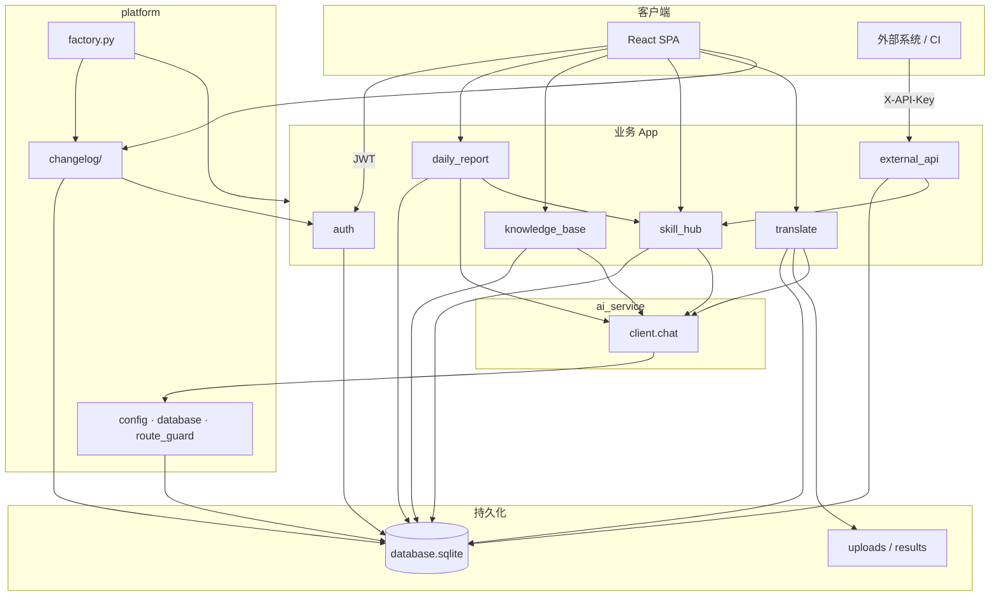

# 开发文档索引（doc/dev）

> 面向二次开发、联调、新模块接入。  
> 文档版本：2026-06-13

---

## 后端模块划分

| 类别 | 目录 | HTTP | 说明 |
|------|------|------|------|
| **platform** | `app/platform/` | `/api/health`、`/`、`/{path}` | 配置、数据库、factory、路由审计 |
| **platform.changelog** | `app/platform/changelog/` | `/api/changelog` | 平台更新日志（platform 子模块，非独立 App） |
| **auth** | `app/auth/` | `/api/auth` | JWT、用户、ticket |
| **skill_hub** | `app/skill_hub/` | `/api/skills` | Skill / 分支 / 版本 |
| **translate** | `app/translate/` | `/api/translate` | 上传、队列、SSE、worker |
| **daily_report** | `app/daily_report/` | `/api/work-daily` | 工作日报：审核、提交、Admin 导出 |
| **tool_hub** | `app/tool_hub/` | `/api/tool-hub` | 工具集：客户端下载 + 平台集成入口 |
| **knowledge_base** | `app/knowledge_base/` | `/api/knowledge-base` | 知识库：文档上传、RAG 问答 |
| **external_api** | `app/external_api/` | `/api/v1/external` | X-API-Key 外部调用 |
| **ai_service** | `app/ai_service/` | **无** | 仅对内 `client.chat`（LLM） |

**业务 App**（与 platform 并列、有独立领域模型）：auth、skill_hub、translate、**daily_report**、**knowledge_base**、external_api。  
**基础设施**：platform（含 `changelog/`）、ai_service。

---

## 文档列表

| 文档 | 说明 |
|------|------|
| [module_internal_api.md](./module_internal_api.md) | **跨模块 Python 调用规范**、依赖矩阵 |
| [database.md](./database.md) | 全库表结构、模块归属、磁盘文件 |
| [platform.md](./modules/platform.md) | 平台层（含 changelog、`/api/health`、SPA） |
| [auth.md](./modules/auth.md) | 认证与用户 |
| [skill_hub.md](./modules/skill_hub.md) | Skill 资产管理 |
| [translate.md](./modules/translate.md) | AI 翻译 |
| [external_api.md](./modules/external_api.md) | 外部 API（X-API-Key） |
| [ai_service.md](./modules/ai_service.md) | LLM 客户端 `chat`（无 HTTP） |
| [daily_report.md](./modules/daily_report.md) | 工作日报（审核 / 提交 / 导出） |
| [tool_hub.md](./modules/tool_hub.md) | 工具集 API 与数据模型 |
| [knowledge_base.md](./modules/knowledge_base.md) | 知识库：RAG 架构与 API |
| [../knowledge_base.md](../knowledge_base.md) | **知识库用户手册**（部署、用法） |
| [tool_hub 测试](../../backend/tests/tool_hub/) | **工具集 pytest 用例**（42 项） |
| [../tool_hub.md](../tool_hub.md) | **工具集使用手册**（下载、解压、工作流） |
| [feature_recorder.md](./modules/feature_recorder.md) | 功能录制客户端（Playwright） |

---

## 平台总览（模块关系）

---

## 前端页面 → 后端映射

| 前端路径 | 主要后端 |
|----------|----------|
| `/login` | auth |
| `/skills`、`/skill/:id`、`/skill/:id/branch/:id` | skill_hub |
| `/tool-hub`、`/tool-hub/:id` | tool_hub |
| `/translate`、`/translate/jobs/:id` | translate（经工具集进入） |
| `/changelog` | platform.changelog |
| `/daily-reports` | daily_report（工作日报） |
| `/knowledge-base`、`/knowledge-base/:kbId` | knowledge_base |
| `/admin` | auth（用户）+ translate（删任务记录） |

---

## 相关文档

- [设计文档](../design.md) — 系统级架构
- [架构指南](../architecture_guide.md) — 单 App 约束与路由约定
- [同机 A/B 部署](../deploy_ab_same_pc.md)
- [如何接入新模块](../how_to_add_new_app.md)

---
