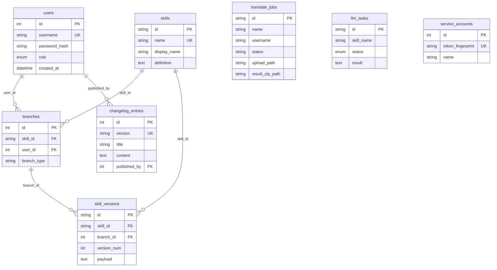
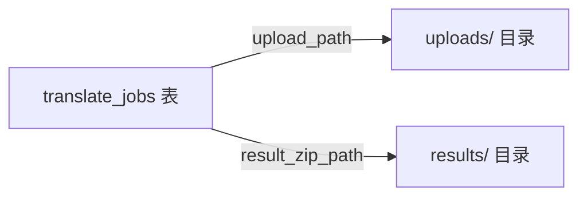

# 数据库与持久化

> 默认单库 SQLite（`DATABASE_URL`），所有 ORM 模型共享 `app.platform.database.Base`。

---

## 1. 表 ↔ 模块总览

| 表名 | 所属模块 | 说明 |
|------|----------|------|
| `users` | **auth** | 登录账号；被 skill_hub、platform.changelog 外键引用 |
| `skills` | **skill_hub** | Skill 仓库根实体 |
| `skill_categories` | **skill_hub** | 平台分类目录（Admin 配置） |
| `branches` | **skill_hub** | 分支（master / standard / personal） |
| `skill_versions` | **skill_hub** | LangGPT payload 不可变版本快照 |
| `changelog_entries` | **platform.changelog** | 平台版本更新说明 |
| `translate_jobs` | **translate** | 翻译任务元数据（**无 FK**，`username` 为冗余字符串） |
| `llm_tasks` | **external_api** | 外部异步 LLM 执行任务 |
| `service_accounts` | **external_api** | 外部 API Key 账户 |
| `knowledge_bases` | **knowledge_base** | 知识库根实体 |
| `knowledge_documents` | **knowledge_base** | 上传文档及处理状态 |
| `knowledge_chat_messages` | **knowledge_base** | RAG 对话历史 |

---

## 2. 各表字段摘要

### 2.1 users（auth）

| 字段 | 类型 | 说明 |
|------|------|------|
| id | Integer PK | JWT `sub` |
| username | String UK | 登录名 |
| password_hash | String | bcrypt |
| role | Enum | `Admin` / `Engineer` |
| created_at | DateTime | 创建时间 |

**模块关系**：`branches.user_id` → 分支归属；`changelog_entries.published_by` → 发布人。

---

### 2.2 skills / branches / skill_versions（skill_hub）

**skills**

| 字段 | 说明 |
|------|------|
| id | UUID 字符串 PK |
| name | 唯一标识，Integration 按 name 查询 |
| display_name | 展示名 |
| definition | 详细定义文本 |
| category | 平台分类 id（见 `skill_hub/categories.py`） |
| tags | JSON 数组字符串，自由标签 |

**branches**

| 字段 | 说明 |
|------|------|
| skill_id | FK → skills.id |
| user_id | FK → users.id |
| branch_type | `master` / `standard` / `personal` |
| 唯一约束 | (skill_id, user_id, branch_type) |

**skill_versions** — LangGPT payload 单字段存储九维内容

| 字段 | 说明 |
|------|------|
| payload | LangGPT Markdown（`# Role` / `## Profile` / …），**唯一内容存储** |
| version_num | 分支内递增 |
| revision | Skill 级全局递增序号 |
| source_version_id | Merge/Fork 溯源（FK → skill_versions.id，可空） |
| commit_message | 用户提交说明 |
| ai_commit_summary | 异步 LLM 生成的变更摘要 |
| extra_metadata | JSON 扩展（可选） |

API 响应仍暴露九维字段，由 `skill_version_to_out()` 从 `payload` 解析。

---

### 2.3 changelog_entries（platform.changelog）

| 字段 | 说明 |
|------|------|
| version | 语义化版本，唯一，如 `1.0.0` |
| title / content | Markdown 正文 |
| published_by | FK → users.id，可空 |

---

### 2.4 translate_jobs（translate）

| 字段 | 说明 |
|------|------|
| id | UUID hex PK |
| name | 任务名称 |
| username | 创建者登录名（**非 FK**） |
| status | queued / running / completed / failed / cancelled |
| upload_path | 磁盘工作目录绝对路径 |
| result_zip_path | 结果 ZIP 路径，可空 |
| current_phase / current_step / total_steps | 进度 |
| message / error | 状态文案 |
| phase2_skill_ref_json | Phase2 SkillRef JSON（可空） |
| phase2_resolved_version_id | Phase2 启动时固化的 version_id |

**模块关系**：仅 translate 读写；与 `users` 逻辑关联但不建外键。

---

### 2.5 llm_tasks / service_accounts（external_api）

**llm_tasks**：外部调用 `execute-async` 后写入；`skill_name` 字符串关联 skills.name（无 FK）。可选 `skill_ref_json`、`resolved_version_id`。

**service_accounts**：存储 API Key 指纹与 bcrypt hash，供 `X-API-Key` 校验。

---

### 2.6 knowledge_bases / knowledge_documents / knowledge_chat_messages（knowledge_base）

**knowledge_bases**

| 字段 | 说明 |
|------|------|
| id | UUID hex PK |
| name / description | 名称与描述 |
| user_id | FK → users.id，创建者 |

**knowledge_documents**

| 字段 | 说明 |
|------|------|
| kb_id | FK → knowledge_bases.id |
| user_id | FK → users.id，上传者 |
| filename / original_path / file_size | 文件信息 |
| status | queued / processing / ready / failed |
| error | 失败原因，可空 |
| chunk_count / asset_count | 分块数 / 图片资产数 |

**knowledge_chat_messages**

| 字段 | 说明 |
|------|------|
| kb_id | FK → knowledge_bases.id |
| user_id | FK → users.id，提问用户 |
| role | user / assistant |
| content | 消息正文 |
| citations_json | 引用 JSON 数组字符串 |

**模块关系**：`users.id` 被 knowledge_bases / knowledge_documents / knowledge_chat_messages 外键引用；向量数据存 ChromaDB，不在 SQL 中。

---

## 3. 磁盘文件（非 SQL）

| 路径 | 模块 | 内容 | 配置 |
|------|------|------|------|
| `backend/app/uploads/` | translate | 解压后的录制包、`translate/phase*` 中间产物 | `TRANSLATE_UPLOAD_DIR` |
| `backend/app/results/` | translate | `{job_id}.zip` 最终结果 | `TRANSLATE_RESULT_DIR` |
| `backend/config/prompts/` | translate | Prompt 模板 md（随代码部署） | — |
| `data/knowledge_base/{kb_id}/raw/` | knowledge_base | 原始上传文件 | `KNOWLEDGE_BASE_DATA_DIR` |
| `data/knowledge_base/chroma/` | knowledge_base | ChromaDB 向量持久化 | `KNOWLEDGE_BASE_CHROMA_DIR` |

**注意**：`upload_path` 存本机路径；A/B 开发/生产目录分离时，库与盘必须同属一套环境（见 [deploy_ab_same_pc.md](../deploy_ab_same_pc.md)）。

---

## 4. 模块间数据依赖（无跨模块写表）

| 调用方 | 读取 | 写入 |
|--------|------|------|
| auth | users | users |
| skill_hub | users, skills, branches, skill_versions | skills, branches, skill_versions |
| platform.changelog | users, changelog_entries | changelog_entries |
| translate | translate_jobs | translate_jobs |
| external_api | skills, skill_versions, llm_tasks, service_accounts | llm_tasks |
| knowledge_base | users, knowledge_bases, knowledge_documents, knowledge_chat_messages | knowledge_bases, knowledge_documents, knowledge_chat_messages |

translate **不**写 skill / platform.changelog 表；skill_hub **不**写 translate_jobs；knowledge_base **不**写其他 App 的表。

---

## 5. 建表时机

`platform.factory` lifespan 内执行 `Base.metadata.create_all()`；translate 另对 `translate_jobs` 做 `name`/`username` 列增量补丁（`translate/bootstrap.py`）；knowledge_base 在 `knowledge_base/bootstrap.py` 中确保三张表存在并执行 schema 补丁（如 `knowledge_documents.user_id`）。

---
