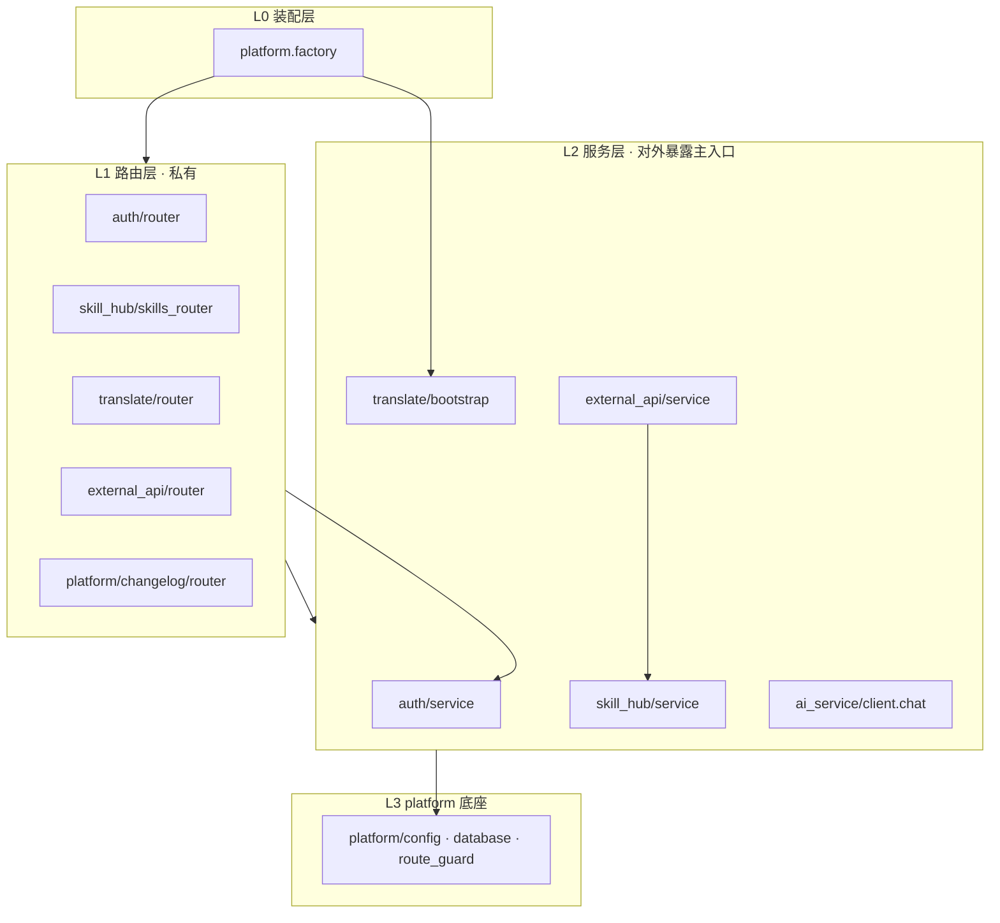

# 模块内部 Python API（跨 App 调用规范）

> 文档版本：2026-06-13  
> 适用范围：`backend/app/` 下各模块（auth、platform、ai_service、skill_hub、translate、external_api）

---

## 1. 两种「接口」

| 类型 | 载体 | 调用方 | 文档位置 |
|------|------|--------|----------|
| **HTTP API** | FastAPI Router | 浏览器、外部系统 | 各模块 `doc/dev/modules/*.md` 第二节 |
| **内部 Python API** | `service.py` 等模块级函数 | **其它 App 进程内 import** | 本文 + 各模块文档「内部 Python API」节 |

原则：**App 之间不走 HTTP 互调**，只通过**显式暴露的 Python 符号**协作；未列入「对外暴露」清单的函数/模块视为**私有实现**。

---

## 2. 分层与允许跳转

| 规则 | 说明 |
|------|------|
| **禁止** | `from app.other_app.router import ...` |
| **禁止** | 跨 App 直接 import `phases/`、`preprocess/`、`jobs.py` 等实现细节 |
| **允许** | 跨 App import 下文「对外暴露」表中的符号 |
| **允许** | 任意 App import `platform.config` / `platform.database` |
| **允许** | 为 ORM 建表在 `platform.registry` 的 `AppModule.models` 中登记（factory 启动时 create_all） |
| **推荐** | 新增跨 App 能力时，在被调用方 `service.py` 增加函数，而非暴露 router |

---

## 3. 依赖矩阵（当前实现）

行 = 调用方，列 = 被调方；✅ = 已有依赖（须在暴露清单内）

| 调用方 ↓ / 被调方 → | auth | platform | ai_service | skill_hub | translate | external_api |
|---------------------|------|----------|------------|-----------|-----------|--------------|
| **auth** | — | ✅ | — | — | — | — |
| **ai_service** | ✅ | ✅ | 内部 | — | — | — |
| **skill_hub** | ✅ | ✅ | ✅ | 内部 | — | — |
| **translate** | ✅ | ✅ | ✅ | — | 内部 | — |
| **external_api** | — | ✅ | ✅ | ✅ | — | 内部 |
| **platform.registry** | router+models | infra + changelog | — | router+models | router+bootstrap+models | router+models |

**platform.changelog**（`platform/changelog/`）仅依赖 auth + database，由 `registry.APPS` 注册；无跨 App Python 暴露。

**模块间无循环依赖**：`skill_hub` ↔ `translate` 互不 import。

---

## 4. 各模块对外暴露清单（摘要）

完整说明见各模块文档「内部 Python API」节。

### 4.1 auth（`app.auth.service` / `app.auth.models`）

| 符号 | 用途 | 允许调用方 |
|------|------|------------|
| `get_current_user` | FastAPI Depends，JWT 用户 | skill_hub, platform.changelog, translate REST, auth/router |
| `get_current_user_by_ticket` | JWT 或 query ticket | translate/router（SSE、下载、prompts） |
| `RequireRole` | 角色依赖 | auth/router, translate/router |
| `User`, `UserRole` | ORM / 类型 | skill_hub（FK）, translate, platform.registry |

**不对外**（auth 模块内部）：`hash_password`、`verify_password`、`create_access_token`、`decode_access_token`、`_resolve_user_via_token_or_ticket`、`TICKETS` 字典。

---

### 4.2 platform（`app.platform.*`）

| 模块 | 符号 | 允许调用方 |
|------|------|------------|
| `config` | `SECRET_KEY`, `DATABASE_URL`, `MINIMAX_*`, `TRANSLATE_*_DIR`, `CORS_ORIGINS`, `BACKEND_PORT` 等 | 全部 App |
| `database` | `Base`, `engine`, `SessionLocal`, `get_db` | 全部 App |
| `route_guard` | `assert_router_protected` | platform.factory（lifespan 循环 APPS） |
| `registry` | `APPS`, `AppModule` | platform.factory |
| `factory` | `create_app`, `app` | run.py、tests |
| `changelog` | （无 Python 暴露，仅 HTTP `/api/changelog`） | — |

**纯底座**（config/database/route_guard）不得 import 业务 App；`registry` + `factory` 为组合根；`platform/changelog` 为平台能力子模块。

---

### 4.3 ai_service（`app.ai_service.client` / `registry`）

| 符号 | 用途 | 允许调用方 |
|------|------|------------|
| `client.chat` | LLM 调用（经 ModelRegistry → Provider） | skill_hub、translate/audit、external_api、news |

**无 HTTP Router。** 内部：`providers/minimax`、`registry.resolve_model`、`news.generate_daily_news`。

| 符号 | 用途 | 允许调用方 |
|------|------|------------|
| `news.generate_daily_news` | Tavily 搜索 + chat 总结 + 可选落盘 | 脚本、将来 AI 控制台 App |
| `news.search_ai_news` | 仅 Tavily 搜索原文 | 内部 / 控制台 |

---

### 4.4 skill_hub（`app.skill_hub.service`）

| 符号 | 用途 | 允许调用方 |
|------|------|------------|
| `get_skill_by_name(db, name)` | 按 name 查 Skill | external_api |
| `get_master_latest_version(db, skill)` | master 最新版（语法糖） | external_api |
| `resolve_skill_ref(db, ref)` | **SkillRef 唯一解析入口** | external_api, translate, 各业务 |
| `get_skill_version_by_id(db, id)` | 按 id 查版本 | 经 resolve 间接使用 |
| `version_to_langgpt_payload(v)` | payload 文本 | external_api, skills_router |
| `version_to_fields(v)` | 九维 dict | external_api |
| `build_version_locator_for_version(db, v)` | 人类可读定位串 | skills_router |
| `allocate_version(db, skill_id, branch_id)` | 分配 version_num + revision | skills_router（内部） |
| `generate_ai_commit_summary` | 异步 commit 摘要 | skills_router（内部） |

**Pydantic 模型（可 import）**：`SkillRef`, `ResolvedSkill`, `ResolveMode` — 见 `app.skill_hub.skill_ref`。

**模型（仅 platform.registry 建表 + ORM FK）**：`Skill`, `Branch`, `SkillVersion` — 其它 App **不得**直接 query，应走 `service`。

详细设计见 [skill_ref_design.md](../skill_ref_design.md)。

**不对外**：`skills_router`, `utils`, `schemas` 给外部 App。

---

### 4.5 translate（`app.translate.bootstrap`）

| 符号 | 用途 | 允许调用方 |
|------|------|------------|
| `migrate_schema(engine)` | translate_jobs 列补丁 | platform.registry → factory lifespan |
| `on_startup()` / `on_shutdown()` | worker 启停 | platform.registry → factory lifespan |

**路径常量**：`app.translate.UPLOAD_DIR` / `RESULT_DIR`（来自 config）— 仅 translate 内部使用。

**不对外**：`jobs`, `worker`, `workflow`, `phases/*`, `router` 给其它 App。

**模型**：`TranslateJob` — 仅 platform.registry 建表。

---

### 4.6 external_api（`app.external_api.service`）

| 符号 | 用途 | 允许调用方 |
|------|------|------------|
| `verify_api_key` | X-API-Key Depends | external_api/router；route_guard 识别名 |
| `ServiceAccount` | ORM | `external_api.models`；platform.registry 建表 |
| `process_llm_task_bg` | 后台任务 | external_api/router |

**模型**：`LLMTask`, `TaskStatus` — platform.registry 建表。

**不对外**：其它 App 不得调用 external_api。

---

## 5. 新增 / 修改跨模块调用时的检查清单

1. 是否必须跨 App？能否合并到同一 App 或只走 HTTP？
2. 在被调用方 **`service.py`**（或 `bootstrap.py`）增加函数，并更新本文 + 该模块文档「对外暴露」表。
3. 调用方仅 import 暴露清单中的符号。
4. 禁止引入循环依赖（A→B 且 B→A）。
5. 补充或更新 pytest（跨模块行为变更时）。

---

## 6. 相关文档

- [dev/README.md](./README.md) — 模块总览与划分  
- [modules/platform.md](./modules/platform.md) — platform（含 changelog）  
- [modules/auth.md](./modules/auth.md) … 各业务 App HTTP + 内部 API 详情  
- [architecture_guide.md](../architecture_guide.md) — 单 App 约束  

---
