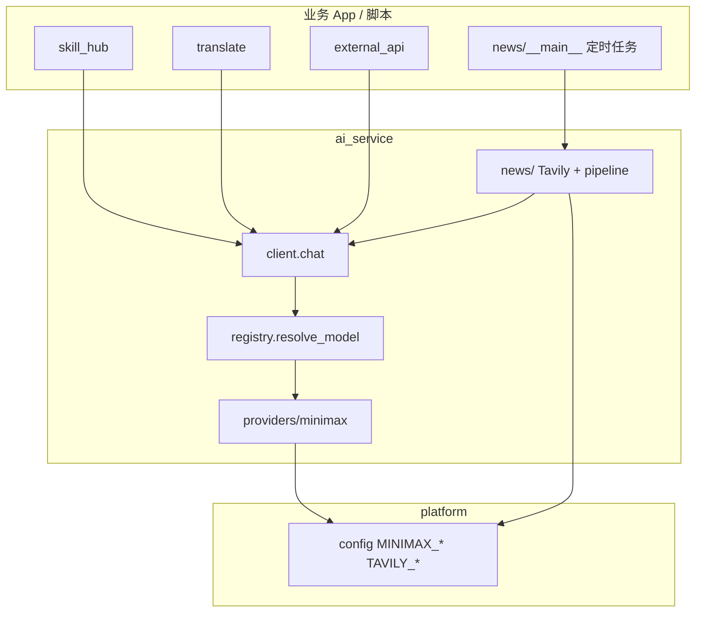

# ai_service 模块

> 代码路径：`backend/app/ai_service/`  
> 定位：**AI 基础服务**（无 HTTP；`chat` 经 ModelRegistry 路由 Provider；含 AI 早报 `news/`）

---

## 1. 模块架构



> **无 `/api/ai/*` HTTP**。业务 prompt 在各自 App（如 `skill_hub/llm_prompts.py`）。

---

## 2. HTTP 接口

**无。** ai_service 不注册 Router。

---

## 3. 对内 Python API

| 模块路径 | 符号 | 用途 | 允许调用方 |
|----------|------|------|------------|
| `ai_service.client` | `chat(...)` | 经 Registry 路由到 Provider | skill_hub、translate、external_api、news |
| `ai_service.registry` | `resolve_model`, `list_models`, `DEFAULT_MODEL_ID` | 平台 model_id → Provider | 内部 |
| `ai_service.news` | `generate_daily_news`, `search_ai_news`, `DailyNewsResult` | AI 早报流水线 | 脚本、将来 AI 控制台 |

**不对外**：`providers/*`、`news/tavily` 实现细节（推荐只调 `news.generate_daily_news`）。

### 3.1 `chat` 传参

```python
await chat(messages, temperature=0.2, think=False)
```

| 参数 | 说明 |
|------|------|
| `messages` | OpenAI Chat Completions 格式 |
| `model` | 默认 `minimax-default` |
| `think` | `False` 时 MiniMax `reasoning_split=true` |

### 3.2 AI 早报（`news/`）

```python
from app.ai_service.news import generate_daily_news

result = await generate_daily_news()
# Tavily → chat → validate → data/ai_news/{date}-AI-Daily-News.md
# result.invalid_links 为非白名单链接列表，正常应为空
```

| 步骤 | 模块 | 说明 |
|------|------|------|
| 搜索 | `news/tavily.py` | `days=1`、`topic=news`；query 含当日日期；返回 `NewsSearchResult`（含 `allowed_urls` 白名单） |
| 总结 | `news/prompts.py` + `pipeline.py` | 要求近 48 小时要闻；每条含「日期\|来源\|链接」；禁止编造与首页链接 |
| 校验 | `news/validate.py` | Markdown 内链接须在 Tavily 白名单内 |
| 落盘 | `news/pipeline.py` | `AI_NEWS_OUTPUT_DIR`（默认 `<项目根>/data/ai_news/`） |

命令行（在 `backend/` 目录）：

```powershell
python -m app.ai_service.news
```

### 3.3 依赖与禁止

| 被调模块 | 允许符号 |
|----------|----------|
| `platform.config` | `MINIMAX_*`, `TAVILY_*`, `AI_NEWS_OUTPUT_DIR` |

- ai_service **不得** import 业务 App
- 其它 App **不得**自建 LLM / Tavily 客户端

---

## 4. 谁调用

| 调用方 | 用法 |
|--------|------|
| translate/audit | `chat(messages, think=False)` |
| skill_hub | `chat(build_*_messages(...))` |
| external_api | `chat(messages, temperature=0.7)` |
| 运维 / 定时任务 | `await generate_daily_news()`（内部 `chat`, `think=False`） |

---

## 5. 后续扩展

| 能力 | 建议落点 |
|------|----------|
| 更多 Provider | `providers/` + `registry.MODELS` |
| AI 控制台 HTTP | 新 App，可调 `generate_daily_news` |
| RAG / Memory | `rag.py` / `memory.py` |

---

*designed by @yuzechao*
