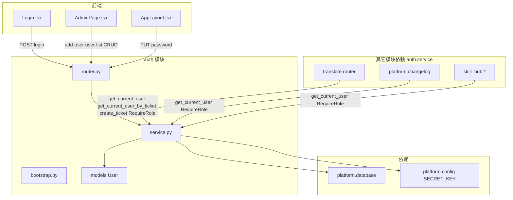

# auth 模块

> 代码路径：`backend/app/auth/`  
> 路由前缀：`/api/auth`（用户与认证统一在此前缀下）

---

## 1. 模块架构

---

## 2. HTTP 接口

| 方法 | 路径 | 鉴权 | 说明 |
|------|------|------|------|
| POST | `/api/auth/login` | 无 | 登录，返回 JWT + user |
| POST | `/api/auth/add-user` | Admin | 添加新用户 |
| GET | `/api/auth/current-user` | JWT | 当前用户信息 |
| GET | `/api/auth/user-list` | Admin | 用户列表 |
| PUT | `/api/auth/password` | JWT | 修改自己的密码 |
| POST | `/api/auth/{user_id}/reset-password` | Admin | 为指定用户更改密码 |
| DELETE | `/api/auth/{user_id}` | Admin | 删除用户 |

---

## 3. 对内服务（非 HTTP，供其它模块 Depends）

| 函数 | 用途 | 调用方 |
|------|------|--------|
| `get_current_user` | 仅 JWT Bearer | 默认：skill_hub、platform.changelog、translate REST、auth 路由 |
| `get_current_user_by_ticket` | JWT（**仅 Header**）或 query `ticket` | 仅 translate SSE / 下载 / prompts |
| `RequireRole(["Admin"])` | 角色校验（基于 get_current_user） | add-user、user-list、platform.changelog 写、translate 删记录 |
| `create_ticket` | 30s 一次性 ticket | translate.router |

> **模块私有**（不列入跨 App API）：`hash_password`、`verify_password`、`create_access_token` — 仅 `auth/router`、`auth/bootstrap`、`scripts/seed_db` 内部使用。

---

## 4. 谁调用哪些接口

### 4.1 前端 → auth

| 前端 | 接口 | 封装 |
|------|------|------|
| `Login.tsx` | POST `/api/auth/login` | `authApi.login` |
| `App.tsx` / `useAuth.ts` | GET `/api/auth/current-user` | `authApi.currentUser`（启动时刷新 localStorage） |
| `AdminPage.tsx` | POST `/api/auth/add-user` | `authApi.addUser` |
| `AdminPage.tsx` | GET `/api/auth/user-list` | `authApi.userList` |
| `AdminPage.tsx` | reset-password、DELETE | `authApi.resetPassword` / `deleteUser` |
| `AppLayout.tsx` | PUT `/api/auth/password` | `authApi.changePassword` |

登录成功后 token/user 存 `localStorage`；其它模块 axios/fetch 自动带 `Authorization`。

### 4.2 后端模块 → auth.service

| 模块 | 依赖 |
|------|------|
| translate | `get_current_user`（REST）、`get_current_user_by_ticket`（SSE/下载）、`create_ticket`、`RequireRole` |
| platform.changelog | `get_current_user`、`RequireRole` |
| skill_hub | `get_current_user` |
| ai_service | —（无 auth 依赖） |

### 4.3 外部系统

external_api **不**走 JWT，使用 `X-API-Key`（见 [external_api.md](./external_api.md)）。

---

## 5. 内部 Python API（供其它 App import）

> 总规范：[module_internal_api.md](../module_internal_api.md)

### 5.1 本模块对外暴露

| 模块路径 | 符号 | 允许调用方 |
|----------|------|------------|
| `auth.service` | `get_current_user` | skill_hub, platform.changelog, translate, auth/router |
| `auth.service` | `get_current_user_by_ticket` | translate/router（SSE、下载、prompts） |
| `auth.service` | `RequireRole` | translate/router, auth/router |
| `auth.bootstrap` | `ensure_default_admin` | platform.factory lifespan, tests/conftest |
| `auth.service` | `create_ticket` | translate/router |
| `auth.models` | `User`, `UserRole` | translate, skill_hub（FK）, platform.factory |

### 5.2 本模块私有（其它 App 不得 import）

| 符号 | 用途 |
|------|------|
| `hash_password` / `verify_password` | bcrypt，注册/登录/改密 |
| `create_access_token` | 签发 JWT |
| `decode_access_token`、`_resolve_user_via_token_or_ticket` | JWT/ticket 解析 |

### 5.3 本模块允许依赖

| 被调模块 | 允许符号 |
|----------|----------|
| `platform.config` | `SECRET_KEY`, `ALGORITHM`, `ACCESS_TOKEN_EXPIRE_MINUTES` |
| `platform.database` | `get_db` |

### 5.4 禁止

- 其它 App **不得** import `auth.router`、`auth.schemas`（HTTP 层私有）
- 其它 App **不得** import 5.2 节私有符号

---

## 6. 数据库

| 表 | 说明 |
|----|------|
| `users` | 本模块唯一拥有的表 |

详见 [database.md](../database.md)。

---

## 7. 对外函数评审（2026-06）

已删除 `get_optional_user`；首用户开放注册改为启动时 `ensure_default_admin()`。

| 符号 | 职责 | 评审结论 | 建议 |
|------|------|----------|------|
| `get_current_user` | 仅 `Authorization: Bearer` JWT，缺/无效 → 401 | **保留** | skill_hub、ai_service、translate REST、Admin 写操作 |
| `get_current_user_by_ticket` | JWT **或** query `ticket`/`token` | **保留** | 仅 translate SSE / 下载 / prompts |
| `RequireRole` | 在 `get_current_user` 之上校验角色 | **跨 App 暴露** | add-user、user-list、platform.changelog 写、translate 删任务 |
| `create_ticket` | 30s 一次性 ticket | **跨 App 暴露** | translate `/ticket` 链路 |
| `hash_password` / `verify_password` | bcrypt | **模块私有** | 仅 auth/router、bootstrap、seed_db |
| `create_access_token` | 签发 JWT | **模块私有** | 仅 auth/router login/register |
| `decode_access_token` | 解析 JWT | **模块私有** | service 内部 |
| `ensure_default_admin` | 空库 seed admin/admin | **保留** | platform.factory lifespan + 测试 conftest |

### 7.1 为何不合并 `get_current_user` 与 `get_current_user_by_ticket`？

- 合并后 skill_hub 等路由也会接受 query ticket，扩大攻击面（ticket 可能出现在 Referer/日志）。
- 当前分层：**Header 场景**用 `get_current_user`；**必须 URL 凭证**用 query `ticket`（一次性，30s）。
- **已废弃**：query `token` 传 JWT（Referer/访问日志泄露风险）。

### 7.2 add-user 返回新用户 token

- 现状：Admin 添加用户后返回**新用户** JWT，便于 Admin 页展示或后续扩展。
- 若前端从不使用该 token，可改为只返回 `UserOut`；**暂不改**，避免破坏 `authApi.addUser` 契约。

---
