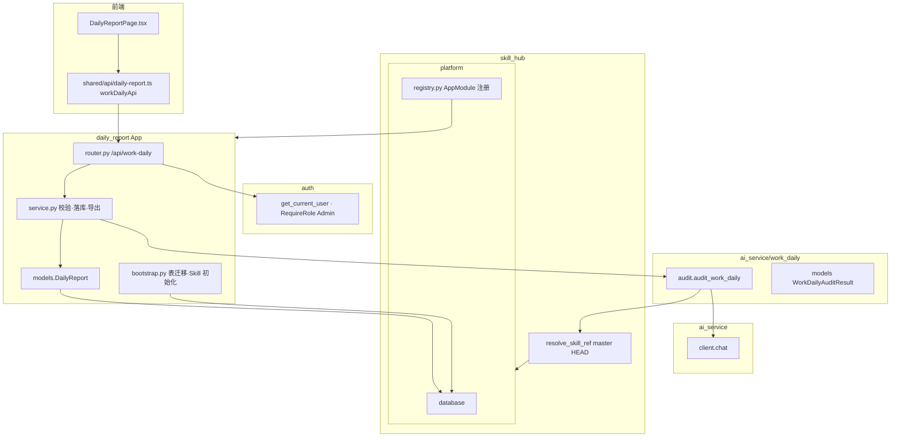

# daily_report 模块（工作日报）

> 代码路径：`backend/app/daily_report/`（HTTP + 持久化）、`backend/app/ai_service/work_daily/`（AI 审核）  
> 路由前缀：`/api/work-daily`  
> 前端路由：`/daily-reports` · 顶栏「工作日报」

> v1（2026-06-15）首版「日报管理」→ v2 重构为「工作日报」：审核/提交分离、同天多次提交、Admin 导出。  
> 需求合并：工作维度与工时占比（师兄）+ 7 天补传 / 原始文件下载（补充）；冲突以师兄文档为准。

---

## 1. 模块架构



**职责分层**

| 层 | 目录 | 职责 |
|----|------|------|
| AI 审核 | `ai_service/work_daily/` | 调 Skill + LLM；解析工作维度、工时占比、补充建议 |
| HTTP 业务 | `daily_report/` | 路由、权限、校验、落库、Admin 导出/下载 |
| Skill 资产 | `skill_hub/platform_skills.py` | 「测试工程师日报解析」平台内置，限制 Fork/建分支 |

---

## 2. HTTP 接口 — `/api/work-daily`

| 方法 | 路径 | 鉴权 | 说明 |
|------|------|------|------|
| POST | `/api/work-daily/audit` | JWT | 审核日报（**不落库**；可反复调用） |
| POST | `/api/work-daily` | JWT | 提交日报（每次新建记录，同天可多次） |
| GET | `/api/work-daily` | JWT | 分页列表（`?page=`、`?page_size=` 默认 10，`?report_date=`、`?user_id=` 仅 Admin） |
| GET | `/api/work-daily/{report_id}` | JWT | 详情（原始文本 + 审核快照） |
| GET | `/api/work-daily/export?report_date=` | JWT Admin | 按日期批量导出全员 JSON |
| GET | `/api/work-daily/download?start_date=&end_date=&user_id=` | JWT | 下载原始 txt zip（每人每天一个文件；Admin 可选用户） |

> **已废弃**：v1 前缀 `/api/daily-reports`（同日期覆盖 + 强制结构化），请勿再使用。

**列表响应（分页）**

```json
{
  "items": [ { "id": "...", "summary_preview": "...", ... } ],
  "total": 42,
  "page": 1,
  "page_size": 10
}
```

- `page` 从 1 开始；`page_size` 默认 10，最大 100
- 按 `created_at` 倒序

### 2.1 请求体

**审核 / 提交公共字段**

```json
{
  "report_date": "2026-06-15",
  "report_role": "测试工程师",
  "raw_text": "纯文本日报..."
}
```

- `report_role`：`测试工程师` | `测试负责人`（与平台账号角色无关）
- 日期：今天及过去 **7 天内**可补传
- 必填提示：**做了什么** + **投入时间**；流程反馈选填

**提交可选带审核快照**

```json
{
  "report_date": "2026-06-15",
  "report_role": "测试工程师",
  "raw_text": "...",
  "audit": { "valid": true, "work_items": [], "suggestions": [] }
}
```

未带 `audit` 时，提交接口会同步调 LLM 审核后再落库。

### 2.2 审核结果 JSON（存于 `audit_json`）

```json
{
  "valid": true,
  "validation_issues": [],
  "suggestions": [],
  "work_items": [
    { "category": "功能测试", "description": "...", "hours": 4, "ratio": 0.5 }
  ],
  "total_hours": 8,
  "dimension_coverage": ["功能测试", "自动化"],
  "missing_dimensions": [],
  "feedback": "可选流程反馈",
  "summary": "一句话总结"
}
```

---

## 3. 谁调用哪些接口

### 3.1 前端 → daily_report

| 页面 / 组件 | 接口 | 封装 |
|-------------|------|------|
| `DailyReportPage` 列表 | GET `/work-daily` | `workDailyApi.list` |
| 新建 → 审核 | POST `/work-daily/audit` | `workDailyApi.audit`（超时 120s） |
| 新建 → 提交 | POST `/work-daily` | `workDailyApi.submit` |
| 详情弹窗 | GET `/work-daily/{id}` | `workDailyApi.get` |
| Admin 导出 | GET `/work-daily/export` | `workDailyApi.exportByDate` |
| 下载原始 zip | GET `/work-daily/download` | `workDailyApi.downloadZip` |

前端文件：

| 路径 | 说明 |
|------|------|
| `frontend/src/daily_report/pages/DailyReportPage.tsx` | 列表 + 新建弹窗（左右分屏审核） |
| `frontend/src/shared/api/daily-report.ts` | `workDailyApi` |
| `frontend/src/router.tsx` | 路由 `/daily-reports` |
| `frontend/src/shared/components/AppLayout.tsx` | 顶栏「工作日报」 |

### 3.2 后端内部

| 调用方 | 被调 | 说明 |
|--------|------|------|
| `daily_report/service.py` | `ai_service.work_daily.audit_work_daily` | 审核 |
| `audit_work_daily` | `skill_hub.service.resolve_skill_ref` | 读 **master HEAD** payload |
| `audit_work_daily` | `ai_service.client.chat` | LLM 调用 |
| `daily_report/bootstrap.py` | `skill_hub` 工具 | 幂等创建 Skill、表迁移 |

### 3.3 依赖其它模块

| 依赖 | 用途 |
|------|------|
| `auth` `get_current_user` / `RequireRole(Admin)` | 所有路由；导出仅 Admin |
| `platform.database` | ORM |
| `ai_service.client.chat` | 审核 LLM |
| `skill_hub` `resolve_skill_ref` | 读取 Skill 内容 |
| `skill_hub.platform_skills` | 平台内置 Skill 写权限/Fork 限制 |

---

## 4. 内部 Python API

### 4.1 `ai_service/work_daily`（供 daily_report 调用）

| 符号 | 说明 |
|------|------|
| `audit_work_daily(db, raw_text, report_date, report_role)` | 返回 `(WorkDailyAuditResult, standard_version_id)` |
| `get_work_daily_standard_version_id(db)` | 落库用 standard 分支 HEAD id |
| `WORK_DAILY_SKILL_NAME` | `Test_Engineer_Daily_Report_Parse` |

### 4.2 `daily_report` 文件清单

| 路径 | 说明 |
|------|------|
| `__init__.py` | HTTP 层常量（列表 limit 等） |
| `models.py` | ORM `DailyReport` |
| `schemas.py` | `WorkDailyAuditRequest` / `WorkDailySubmitRequest` / `WorkDailyOut` |
| `daily_report/service.py` | 校验、列表、提交、导出、下载 zip |
| `router.py` | HTTP 路由 |
| `bootstrap.py` | `migrate_schema()` + `ensure_work_daily_skill()` |

测试：`backend/tests/test_work_daily_requirements.py`、`test_daily_report.py`、`test_platform_skills.py`

---

## 5. 数据库

表 `daily_reports`（v2）：

| 字段 | 说明 |
|------|------|
| `id` | UUID PK |
| `user_id` | FK → users |
| `report_date` | 日报日期 |
| `report_role` | 测试工程师 / 测试负责人 |
| `raw_text` | 原始纯文本 |
| `audit_json` | 审核结果 JSON 快照 |
| `skill_version_id` | FK → skill_versions（**standard HEAD**） |
| `created_at` | 提交时间 |

- **无** `(user_id, report_date)` 唯一约束：同天可多次提交
- 启动时 `bootstrap.migrate_schema()` 从 v1（`structured_json`、唯一约束等）自动迁移

| 角色 | 列表 | 详情 | 提交 | 导出/下载 |
|------|------|------|------|-----------|
| Engineer | 仅自己 | 仅自己 | 仅自己 | 仅自己 |
| Admin | 全部 | 全部 | 可提交 | 全员导出 + 可选用户 zip |

详见 [database.md](../database.md)。

---

## 6. Skill 与平台权限

### 6.1 工作日报解析 Skill

| 项 | 值 |
|----|-----|
| 名称 | `Test_Engineer_Daily_Report_Parse` |
| 显示名 | 测试工程师日报解析 |
| 分类 | `documentation` |
| **运行时审核** | `skill-hub:[master:latest]` |
| **落库 skill_version_id** | standard 分支 HEAD |
| 创建 | `bootstrap.ensure_work_daily_skill()` 启动幂等 |

`SkillOut.platform_locked = true` 时，前端 Skill 页隐藏「创建个人分支 / Fork」。

### 6.2 平台内置 Skill 权限（`skill_hub/platform_skills.py`）

针对 `Test_Engineer_Daily_Report_Parse`：

| 操作 | Admin | 普通用户 |
|------|-------|----------|
| 创建 personal 分支 | ❌ | ❌ |
| Fork | ❌ | ❌ |
| 编辑 master | ❌ | ❌ |
| 编辑 standard | ✅ | ❌ |
| Merge 到 master | ❌ | ❌ |
| 查看 | ✅ | ✅ |

---

## 7. 功能演进（v1 → v2）

| 能力 | v1 日报管理 | v2 工作日报 |
|------|-------------|-------------|
| 导航 | 日报管理 | **工作日报** |
| API | `/api/daily-reports` | **`/api/work-daily`** |
| 提交 | 同日期覆盖 | **同天多次，不覆盖** |
| LLM | 提交时强制结构化 | **审核与提交分离** |
| 日报角色 | 无 | 测试工程师 / 测试负责人 |
| 日期 | 任意 | 今天及过去 7 天 |
| Skill | `Daily_Report_Structurer` | `Test_Engineer_Daily_Report_Parse` |
| Admin | 仅列表 | 按日 JSON 导出 + txt zip 下载 |

### 7.1 前端交互要点

1. 列表展示历史记录；右上角「新建日报」
2. 弹窗左右分屏：左编辑 +「审核」「提交」；右审核建议、维度、占比
3. 审核中左侧只读 + Progress 进度条（LLM 约 10–30s）
4. 修改正文不清空右侧已有审核结果；需重新点审核更新
5. 列表「内容摘要」= 原始文本预览；详情 = AI 摘要 + 原始文本

### 7.2 师兄需求对照（验收基线）

| # | 需求 | 实现 | 自动化测试 |
|---|------|------|------------|
| REQ-1 | 导航栏「工作日报」 | `AppLayout.tsx` label；路由 `/daily-reports` | 前端人工 |
| REQ-2 | 过往 list +「新建日报」 | `DailyReportPage` 列表 + 右上角按钮 | `test_list_after_submit` |
| REQ-3a | 左：日期、角色、纯文本 | 弹窗左侧 DatePicker / Select / TextArea | `test_report_roles` |
| REQ-3b | 审核 → skill master:latest | `audit_work_daily` → `resolve_skill_ref(master)` | `test_audit_uses_master_skill` |
| REQ-3c | 右：缺失维度/占比提示 | `AuditPanel` 展示 suggestions / missing_dimensions | `test_incomplete_audit_returns_suggestions` |
| REQ-3d | 可反复审核 | POST `/audit` 不落库，可多次调用 | `test_reaudit_multiple_times` |
| REQ-3e | 可忽略审核直接提交 | POST `/` 带或不带 `audit` 字段 | `test_submit_with_audit_snapshot_skips_llm` |
| REQ-4 | Admin 按日期导出全员 | GET `/export?report_date=` | `test_admin_export_all_engineers_on_date` |

### 7.3 自动化测试

```powershell
cd backend
python -m pytest tests/test_work_daily_requirements.py tests/test_daily_report.py -v
```

| 文件 | 说明 |
|------|------|
| `tests/test_work_daily_requirements.py` | 师兄需求 REQ-2～REQ-4 验收 |
| `tests/test_daily_report.py` | API 基础与 dict 建议格式化 |
| `tests/test_platform_skills.py` | 日报 Skill 平台权限 |

**2026-06-15 修复（需求自测）：**

- 重新审核时右侧保留上次审核建议（`AuditResultBody` 在 loading 态仍渲染）
- 审核进度文案明确为 skill-hub master 解析

---

## 8. 联调测试样例

角色可选：**测试工程师**、**测试负责人**。在「新建日报」弹窗粘贴以下文本测试。

### 8.1 完整合规（推荐先测）

**角色：** 测试工程师 · **预期：** valid=true

```
今日工作：
1. TestAI 社区平台 - 工作日报模块联调，前后端接口对接、列表展示，约 4 小时
2. 回归测试 Skill Hub 分支合并流程，编写 3 条用例并执行，约 2 小时
3. 参加测试组周会，同步本周风险，约 1 小时
4. 整理接口测试文档（Swagger 补充说明），约 1 小时
合计约 8 小时。
```

### 8.2 缺少工时 · **预期：** 提示补充

```
今天主要做了这些事：
- 完成了支付模块冒烟测试
- 跟开发联调了退款接口
整体比较充实，没有明显阻塞。
```

### 8.3 缺少工作内容 · **预期：** 提示补充

```
今日工时：上午 4h，下午 3.5h，合计 7.5h。
```

### 8.4 多维度 + 占比 · **预期：** work_items.ratio 合计 ≈ 1.0

```
【工作分布】
- 功能测试：3h，约占 37.5%
- 接口自动化：2h，约占 25%
- 需求评审：1.5h，约占 18.75%
- 缺陷回归：1h，约占 12.5%
- 文档：0.5h，约占 6.25%
总投入 8h。
```

### 8.5 同天第二条 · **预期：** 列表两条，不覆盖

```
下午追加：hotfix 验证 2h；验证报告 0.5h。合计 2.5h。
```

### 8.6 建议测试顺序

| 顺序 | 样例 | 验证点 |
|------|------|--------|
| 1 | 8.1 | 审核 → 提交 → 列表 |
| 2 | 8.2 / 8.3 | 右侧补充建议 |
| 3 | 8.4 | 维度与占比 |
| 4 | 8.5 | 同天多条记录 |
| 5 | Admin | 导出 JSON、下载 zip |

更多边界样例（测试负责人、模糊文本、英文混杂等）见历史文档已合并入本节，可按需扩展。

---

## 9. 启动与验证

```powershell
# 项目根目录一键重启（推荐）
.\restart_dev.ps1

# 或手动
cd backend && python run.py
cd frontend && npm run dev
```

浏览器：**http://localhost:3003** → 工作日报 → 新建 → 审核 → 提交。

---

## 10. 常见问题

| 问题 | 说明 | 建议 |
|------|------|------|
| Skill 列表空 / 500 | 多为 `skill_hub/schemas` 导入错误或旧后端未重启 | 重启后端；查 `/api/skills` |
| 审核 502 | `MINIMAX_API_KEY` 未配置 | 配置 `.env` |
| 审核慢 | 主因 LLM API 延迟 | 已降 max_tokens/重试；前端有进度条 |
| 多实例占端口 | 48010 / 3003 被旧进程占用 | 使用 `restart_dev.ps1` |
| SQLite 路径 | `DATABASE_URL` 相对 backend 工作目录 | 始终在 `backend/` 下启动 |
| Skill 未创建 | 无 Admin 时 bootstrap 跳过 | 确保库中有 Admin 后重启 |

---

*designed by @yuzechao*
