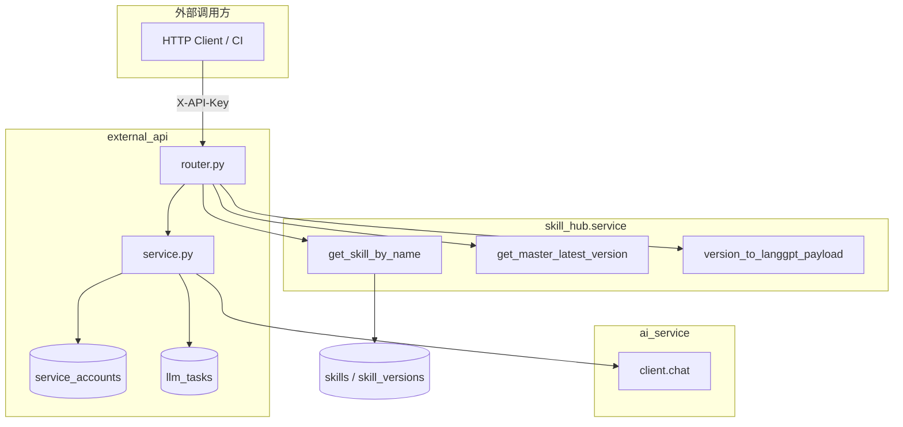

# external_api 模块（外部 API）

> 代码路径：`backend/app/external_api/`  
> 路由前缀：`/api/v1/external`  
> 认证：**`X-API-Key`**（非 JWT）

供工具链 / CI / 脚本在不登录的情况下，读取 **master 最新 Skill** 并异步执行 LLM。

---

## 1. 模块架构



---

## 2. HTTP 接口

| 方法 | 路径 | 鉴权 | 说明 |
|------|------|------|------|
| GET | `/skills/{skill_name}` | X-API-Key | 取 **master 最新版** Markdown（无则 standard） |
| POST | `/skills/{skill_name}/invoke` | X-API-Key | **同步调用**发布版 Skill，直接返回 LLM 输出 |
| POST | `/skills/{skill_name}/execute-async` | X-API-Key | 异步执行 LLM，202 + task_id |
| GET | `/tasks/{task_id}` | X-API-Key | 查询异步任务状态/结果 |

**请求头**

```http
X-API-Key: <service account token>
```

`service_accounts` 表需预置 API Key（bcrypt hash 存储）。

---

## 3. 谁调用哪些接口

### 3.1 前端

**当前 React SPA 不调用** external_api。

### 3.2 外部系统

1. `GET /api/v1/external/skills/{name}` — 拉取发布版 Markdown  
2. `POST .../invoke` + `{ "user_input": "..." }` — 同步调用（推荐简单集成）  
3. `POST .../execute-async` + 轮询 `GET /api/v1/external/tasks/{task_id}` — 长任务异步  

### 3.3 后端内部依赖

| 组件 | 调用 |
|------|------|
| router | `skill_hub.service`（读 Skill） |
| `process_llm_task_bg` | `get_master_latest_version`、`client.chat(messages)`、写 `llm_tasks` |

**不写** skills / branches / skill_versions 表。

---

## 4. 与 skill_hub 的分工

| | skill_hub（JWT） | external_api（X-API-Key） |
|---|------------------|---------------------------|
| 用户 | 人 | 机器 |
| 能力 | 编辑、Merge、Fork | 只读 master + 跑 LLM |
| 表 | skills 全家桶 | service_accounts、llm_tasks |

---

## 5. 内部 Python API（供其它 App import）

> 总规范：[module_internal_api.md](../module_internal_api.md)

### 5.1 本模块对外暴露

| 模块路径 | 符号 | 允许调用方 |
|----------|------|------------|
| `external_api.service` | `verify_api_key` | router；`route_guard` 识别依赖名 |
| `external_api.models` | `ServiceAccount`, `LLMTask`, `TaskStatus` | platform.registry 建表 |
| `external_api.service` | `process_llm_task_bg` | router（BackgroundTasks） |

### 5.2 本模块允许依赖

| 被调模块 | 允许符号 |
|----------|----------|
| `skill_hub.service` | `get_skill_by_name`, `get_master_latest_version`, `version_to_langgpt_payload` |
| `ai_service.client` | `chat` |
| `platform.database` | `get_db`, `SessionLocal`, `Base` |

### 5.3 禁止

- 其它 App **不得** import external_api
- external_api **不得** import auth JWT 流程（与 X-API-Key 并列、隔离）
- **不得**写 skill_hub 的 skills/branches/versions 表

---

## 6. 数据库

| 表 | 说明 |
|----|------|
| `service_accounts` | API Key |
| `llm_tasks` | 异步任务 |
| `skills` / `skill_versions` | 只读 |

详见 [database.md](../database.md)。

---

*designed by @yuzechao*
