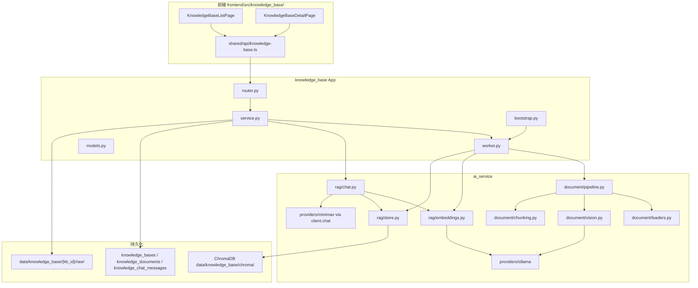
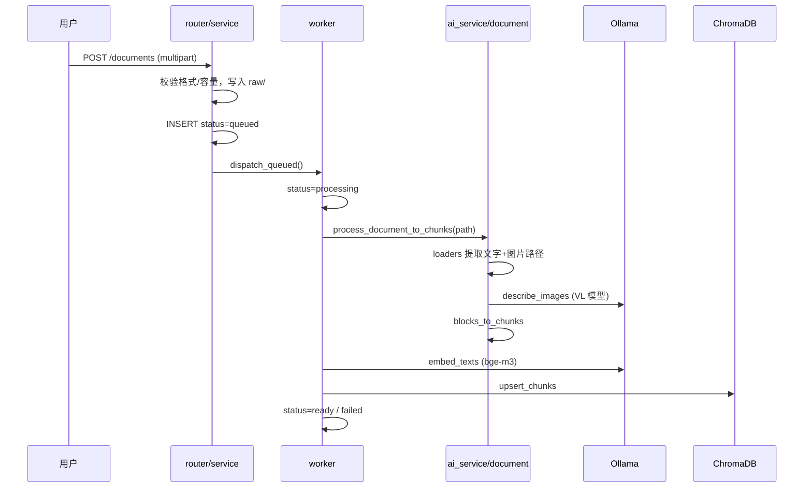
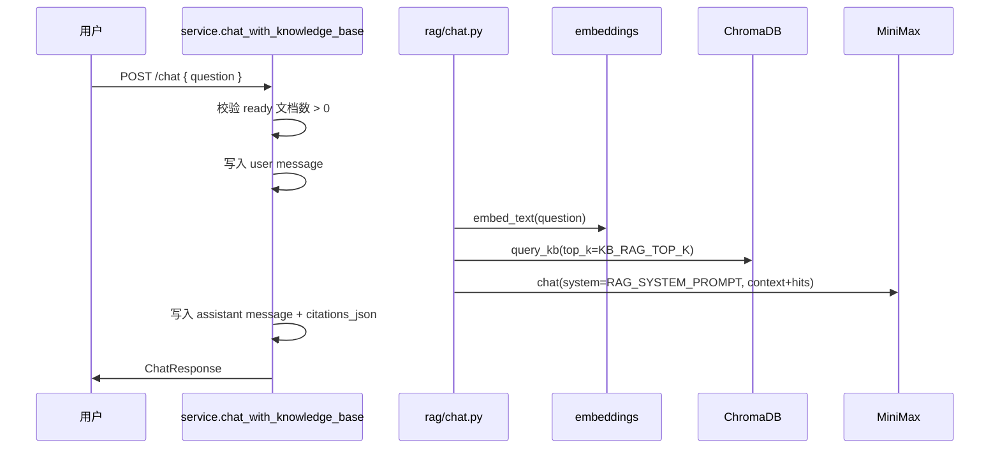

# 知识库模块

> 代码路径：`backend/app/knowledge_base/`、`frontend/src/knowledge_base/`  
> 路由前缀：`/api/knowledge-base`  
> 文档版本：2026-06-16

---

## 1. 模块定位

知识库是独立 **业务 App**，提供文档上传、异步处理、向量检索与 RAG 问答。核心 AI 能力（文档解析、Embedding、检索、生成）复用 `ai_service/document/` 与 `ai_service/rag/`，本模块负责 HTTP、权限、队列调度与持久化。

---

## 2. 总体架构



---

## 3. 文档处理流水线



### 3.1 分块策略（`document/chunking.py`）

1. 按 Markdown 标题（`#` ~ `######`）粗分节
2. 超长节按 `KB_CHUNK_SIZE`（默认 800 字符）滑动窗口切分，重叠 `KB_CHUNK_OVERLAP`（默认 120）
3. 图片 VL 描述作为独立 chunk（`block_type=image_caption`）

### 3.2 模型分工

| 环节 | 实现 | 模型 / 技术 |
|------|------|-------------|
| md/txt/docx/pdf/pptx/xlsx 文字 | `document/loaders.py` | 解析库；`.doc` 经 LibreOffice 转 docx |
| 图片/流程图 | `document/vision.py` | Ollama `OLLAMA_VL_MODEL` |
| 向量化 | `rag/embeddings.py` | Ollama `OLLAMA_EMBED_MODEL`（bge-m3） |
| 向量存储与检索 | `rag/store.py` | ChromaDB，cosine 距离 |
| 答案生成 | `rag/chat.py` | MiniMax `MINIMAX_MODEL` |

---

## 4. RAG 问答流水线



检索命中 metadata 含 `filename`、`page`、`doc_id`、`block_type`，用于前端展示引用来源。

---

## 5. 后端文件结构

```
backend/app/knowledge_base/
├── __init__.py          # App 元信息
├── bootstrap.py         # 建表、schema 补丁、Worker 启停
├── config.py            # 常量（扩展名、队列参数，引用 platform.config）
├── models.py            # ORM：KnowledgeBase / KnowledgeDocument / KnowledgeChatMessage
├── schemas.py           # Pydantic 请求/响应
├── router.py            # HTTP 路由
├── service.py           # 业务逻辑与权限
└── worker.py            # 异步文档处理调度
```

### 5.1 Worker 调度

- 启动：`bootstrap.on_startup()` → `start_background_tasks()`，2 秒轮询 + 上传触发
- 并发：`KB_MAX_CONCURRENT_JOBS`（默认 2）
- 单文档超时：`DOCUMENT_PROCESS_TIMEOUT_SEC = 600`
- 状态机：`queued` → `processing` → `ready` | `failed`

### 5.2 权限模型（`service.py`）

| 操作 | 条件 |
|------|------|
| 列表 / 详情 / 上传 / 对话 | 所有登录用户 |
| 删除文档 | `doc.user_id == current_user.id` 或 Admin |
| 修改 / 删除知识库 | `kb.user_id == current_user.id` 或 Admin |

---

## 6. HTTP 接口

| 方法 | 路径 | 说明 |
|------|------|------|
| GET | `/knowledge-base/bases` | 全站知识库列表 |
| POST | `/knowledge-base/bases` | 创建知识库 |
| GET | `/knowledge-base/bases/{id}` | 详情 + 文档列表 |
| PATCH | `/knowledge-base/bases/{id}` | 更新名称/描述 |
| DELETE | `/knowledge-base/bases/{id}` | 删除库、raw 文件、Chroma collection |
| POST | `/knowledge-base/bases/{id}/documents` | 上传文档（multipart `file`） |
| DELETE | `/knowledge-base/bases/{id}/documents/{doc_id}` | 删除文档及向量 |
| POST | `/knowledge-base/bases/{id}/chat` | RAG 问答 `{ question }` |
| GET | `/knowledge-base/bases/{id}/messages` | 当前用户对话历史（最近 50 条） |

所有接口需 JWT Bearer 认证（`get_current_user`）。

---

## 7. 数据模型

### 7.1 knowledge_bases

| 字段 | 说明 |
|------|------|
| id | UUID hex PK |
| name / description | 名称与描述 |
| user_id | FK → users.id，创建者 |
| created_at / updated_at | 时间戳 |

### 7.2 knowledge_documents

| 字段 | 说明 |
|------|------|
| id | UUID hex PK |
| kb_id | FK → knowledge_bases.id |
| user_id | FK → users.id，上传者 |
| filename / original_path / file_size | 文件信息 |
| status | queued / processing / ready / failed |
| error | 失败原因 |
| chunk_count / asset_count | 处理结果统计 |

### 7.3 knowledge_chat_messages

| 字段 | 说明 |
|------|------|
| id | UUID hex PK |
| kb_id / user_id | 所属库与提问用户 |
| role | user / assistant |
| content | 消息正文 |
| citations_json | 引用 JSON 数组 |

---

## 8. 前端结构

| 路径 | 组件 | 说明 |
|------|------|------|
| `/knowledge-base` | `KnowledgeBaseListPage` | 卡片列表、新建、删除 |
| `/knowledge-base/:kbId` | `KnowledgeBaseDetailPage` | 文档列表、上传、对话 |

API 封装：`frontend/src/shared/api/knowledge-base.ts`（TanStack Query）。

详情页在有 `queued`/`processing` 文档时每 3 秒 `refetchInterval` 刷新。

---

## 9. 环境变量

| 变量 | 默认 | 说明 |
|------|------|------|
| `KNOWLEDGE_BASE_DATA_DIR` | `<项目根>/data/knowledge_base` | 原始文件根目录 |
| `KNOWLEDGE_BASE_CHROMA_DIR` | `{DATA_DIR}/chroma` | Chroma 持久化路径 |
| `KB_MAX_UPLOAD_MB` | 30 | 单文件上限 |
| `KB_MAX_TOTAL_MB` | 500 | 单库总容量 |
| `KB_MAX_DOCS_PER_KB` | 100 | 单库文档数 |
| `KB_MAX_CONCURRENT_JOBS` | 2 | Worker 并发 |
| `KB_CHUNK_SIZE` | 800 | 分块大小 |
| `KB_CHUNK_OVERLAP` | 120 | 分块重叠 |
| `KB_RAG_TOP_K` | 6 | 检索 top-k |
| `OLLAMA_BASE_URL` | `http://127.0.0.1:11434` | Ollama 地址 |
| `OLLAMA_VL_MODEL` | `qwen2.5vl:7b` | 视觉模型 |
| `OLLAMA_EMBED_MODEL` | `bge-m3` | Embedding 模型 |
| `MINIMAX_API_KEY` | — | 问答生成（必需） |
| `LIBREOFFICE_SOFFICE_PATH` | — | `.doc` 转换（可选） |

---

## 10. 对内 Python 依赖

| 调用方 | 被调模块 | 符号 |
|--------|----------|------|
| knowledge_base/worker | ai_service.document | `process_document_to_chunks` |
| knowledge_base/worker | ai_service.rag | `embed_texts`, `upsert_chunks`, `delete_document_chunks` |
| knowledge_base/service | ai_service.rag | `answer_with_rag`, `delete_kb_collection` |

knowledge_base **不得**直接调用 Ollama / MiniMax Provider，统一经 ai_service。

---

## 11. 测试

| 文件 | 覆盖 |
|------|------|
| `backend/tests/test_knowledge_base.py` | CRUD、权限、容量校验 |
| `backend/tests/test_knowledge_base_flow.py` | 上传→处理→问答集成流（mock ai_service） |

---

## 12. 相关文档

- [知识库用户手册](../../knowledge_base.md)
- [ai_service 模块](./ai_service.md) — document / RAG 子包
- [database.md](../database.md) — 表结构与磁盘路径
- [requirements.md](../../requirements.md) §3.8

---

*designed by @yuzechao*
