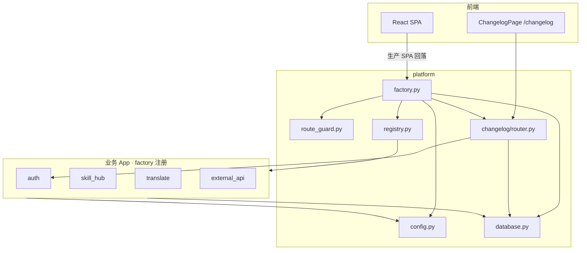

# platform 模块

> 代码路径：`backend/app/platform/`  
> 定位：**平台层** — 配置、数据库、应用装配、路由安全审计；含子目录 `changelog/`（平台更新日志）

---

## 1. 模块架构

platform 分三层：**纯底座**（不 import 业务 App）→ **组合根 factory**（装配全站）→ **`changelog/`**（唯一带 HTTP 的平台能力子目录，体量小、无跨 App Python 暴露）。



> LLM 在 [ai_service.md](./ai_service.md)，不在 platform。

**依赖规则**

- `config` / `database` / `route_guard`：**不得** import 业务 App  
- `changelog/`：仅依赖 `platform.database` + `auth`（鉴权 Depends）  
- `registry.py`：集中声明各 App 的 `AppModule`；`factory.py` 只循环 `APPS` 装配

---

## 2. 子模块职责

| 路径 | 职责 |
|------|------|
| `config.py` | 读 `.env`：端口、DB、LLM Key、`TRANSLATE_*_DIR`、`SECRET_KEY` |
| `database.py` | SQLAlchemy `engine`、`SessionLocal`、`get_db`、`Base` |
| `route_guard.py` | 启动时路由鉴权静态检查（见 §5） |
| `registry.py` | 全站 `AppModule` 注册表（**新增 App 主要改这里**） |
| `app_module.py` | `AppModule`  dataclass（router / models / lifespan 钩子） |
| `factory.py` | `create_app()`：循环 `APPS` 装配，不逐个 import 业务 bootstrap |
| `changelog/` | `router` + `models` + `schemas`；表 `changelog_entries`；前缀 `/api/changelog` |

### 2.1 App 注册表（`registry.APPS`）

`factory` 不逐个 import 各 App 的 bootstrap，而是循环 `registry.APPS`：

```text
import models → create_all → startup_sync → startup_async → route_guard → include_router
进程关闭：shutdown_async（逆序）
```

| App | startup_sync | startup_async | shutdown_async |
|-----|--------------|---------------|----------------|
| auth | `ensure_default_admin` | — | — |
| translate | `migrate_schema` | worker 启动 | worker 停止 |
| 其它 | — | — | — |

**新增 App**：在 `registry.py` 追加一条 `AppModule`（含 router、models、可选钩子）。`ai_service` 无 HTTP，不在表中。

---

## 3. HTTP 接口

platform 对外 HTTP 分两类：**factory 内置**（探活、SPA）与 **`changelog/` 路由**（业务 JSON API）。均由 `factory` 注册，前缀均在 `/api` 或站点根路径。

| 方法 | 路径 | 鉴权 | 说明 |
|------|------|------|------|
| GET | `/api/health` | 无 | 探活 `{"status":"ok",...}` |
| GET | `/` | 无 | 生产：返回 `frontend/dist/index.html` |
| GET | `/{path}` | 无 | 生产：SPA fallback（非 `/api/*`） |
| GET | `/api/changelog` | JWT | 更新日志列表，`?limit=50` |
| GET | `/api/changelog/{entry_id}` | JWT | 单条详情 |
| POST | `/api/changelog` | Admin | 新建（版本号唯一，如 `1.0.0`） |
| PUT | `/api/changelog/{entry_id}` | Admin | 更新 |
| DELETE | `/api/changelog/{entry_id}` | Admin | 删除 |

**调用说明**

| 路径 | 谁调 |
|------|------|
| `/api/health` | 部署探活、pytest；前端不调 |
| `/`、`/{path}` | 生产环境浏览器整页打开/刷新；开发模式由 Vite 代理，通常不走后端 |
| `/api/changelog` | 前端 `ChangelogPage`（`shared/api/changelog.ts`）；无其它后端模块调用 |

---

## 4. 对内 Python API（供其它 App import）

> 完整矩阵：[module_internal_api.md](../module_internal_api.md)

| 符号 | 所在文件 | 允许调用方 |
|------|----------|------------|
| `get_db()` | `database` | 全部 router |
| `SessionLocal` | `database` | translate jobs、skill 异步、external_api |
| `Base`, `engine` | `database` | factory lifespan |
| `SECRET_KEY`, `MINIMAX_*`, `CORS_ORIGINS`, `TRANSLATE_*_DIR` 等 | `config` | 各 App 按需 |
| `assert_router_protected()` | `route_guard` | factory lifespan |

**changelog 无对外 Python API**；其它模块不得 `import platform.changelog.router`。

---

## 5. `route_guard`（不是 auth 鉴权）

| | **auth** | **platform.route_guard** |
|---|----------|---------------------------|
| 何时 | 每个 HTTP 请求 | 应用**启动时一次** |
| 做什么 | 验 JWT / ticket、判角色 | 扫描 Router 是否挂 `get_current_user` 等 |
| 失败 | 401/403 | **进程启动失败** |

放在 platform 的原因：审计对象是**全站 Router**，与 factory 同生命周期；auth 不应反向依赖各业务 App 去扫路由。

---

## 6. 谁调用

### 6.1 后端 / 运维

| 调用方 | 用途 |
|--------|------|
| `run.py` | `uvicorn app.platform.factory:app` |
| `tests/conftest.py` | `TestClient(app)` |
| 全部业务 App | `Depends(get_db)`、`platform.config` |

### 6.2 前端

| 页面 | platform 相关 API |
|------|-------------------|
| （无专门页） | `/api/health` 通常不调 |
| 整站 | 生产下 `/`、刷新子路径 → factory SPA |
| `ChangelogPage` `/changelog` | `/api/changelog` CRUD |

---

## 7. 数据库

platform 提供 `Base` 与连接；**仅 `changelog/` 拥有业务表**：

| 表 | 说明 |
|----|------|
| `changelog_entries` | 平台发版记录：`version`（唯一）、`title`、`content`、`published_by` → `users.id` |

全库 ER 与其它表见 [database.md](../database.md)。

---

*designed by @yuzechao*
