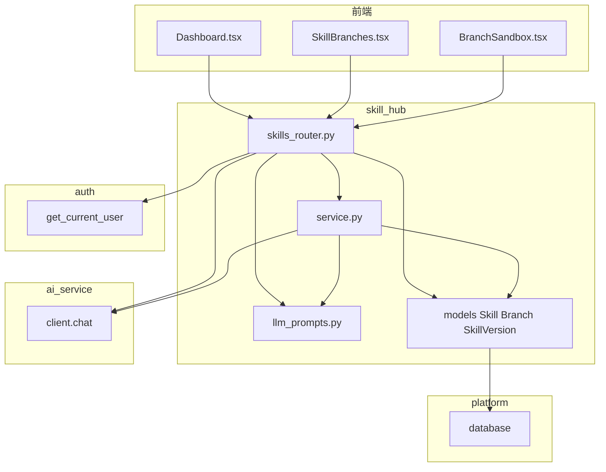
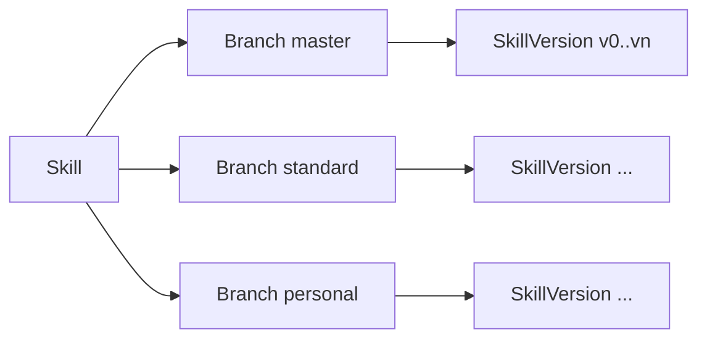

# skill_hub 模块

> 代码路径：`backend/app/skill_hub/`  
> 路由前缀：`/api/skills`

---

## 1. 模块架构

**分支模型**

---

## 2. HTTP 接口 — `/api/skills`

| 方法 | 路径 | 鉴权 | 说明 |
|------|------|------|------|
| GET | `/skills` | JWT | Skill 列表 |
| POST | `/skills` | JWT Admin | 创建 Skill + master/standard 分支 + v0 |
| GET | `/skills/{skill_id}` | JWT | Skill 详情 |
| GET | `/skills/{skill_id}/branches` | JWT | 分支列表（含 user 信息） |
| POST | `/skills/{skill_id}/branches` | JWT | 当前用户创建 personal 分支（幂等） |
| GET | `/skills/{skill_id}/branches/{branch_id}/versions` | JWT | 版本列表 |
| POST | `/skills/{skill_id}/branches/{branch_id}/versions` | JWT | 提交新版本（异步 AI summary） |
| POST | `/skills/{skill_id}/merge` | JWT Admin | 合并到 master |
| POST | `/skills/{skill_id}/branches/{branch_id}/fork` | JWT | Fork 到 personal |
| POST | `/skills/{skill_id}/branches/{branch_id}/evaluate-draft` | JWT | Commit 前 LLM 评估 |

---

## 3. 谁调用哪些接口

### 3.1 前端 → skill_hub

| 页面 | 接口 | 封装 `skillsApi` |
|------|------|------------------|
| Dashboard | GET/POST `/skills` | list, create |
| SkillBranches | GET branches, POST branches | listBranches, createBranch |
| BranchSandbox | GET versions, POST versions | getVersions, createVersion |
| BranchSandbox | POST evaluate-draft, fork, merge | evaluateDraft, fork, merge |

前端文件：`frontend/src/shared/api/client.ts`

### 3.2 后端内部

| 调用方 | 被调 | 说明 |
|--------|------|------|
| skills_router | `service.get_skill_by_name` | 按 name 查 Skill |
| skills_router | `service.generate_ai_commit_summary` | 新版本异步 diff 摘要 |
| skills_router | `ai_service.client.chat` + `llm_prompts` | evaluate-draft |
| external_api | `service.get_master_latest_version` | 取 master 最新版 |
| external_api | `service.version_to_langgpt_payload` | 拼 LangGPT 文本 |

### 3.3 依赖其它模块

| 依赖 | 用途 |
|------|------|
| auth `get_current_user` | 所有 skills 路由 |
| auth `UserRole.Admin` | 创建 Skill、Merge |
| `platform.database` | ORM |
| ai_service `client.chat` | LLM 调用；prompt 见本模块 `llm_prompts.py` |

---

## 4. 内部 Python API（供其它 App import）

> 总规范：[module_internal_api.md](../module_internal_api.md)

### 4.1 本模块对外暴露（`skill_hub.service`）

| 函数 | 签名要点 | 允许调用方 |
|------|----------|------------|
| `get_skill_by_name` | `(db, name) → Skill \| None` | **external_api** |
| `get_master_latest_version` | `(db, skill) → SkillVersion \| None` | **external_api** |
| `version_to_langgpt_payload` | `(v) → str` | **external_api**, skills_router |
| `get_skill_version` | `(db, version_id)` | 仅 skills_router（模块内） |
| `get_latest_version_num` | `(db, branch_id)` | 仅 skills_router（模块内） |
| `generate_ai_commit_summary` | async | 仅 skills_router（模块内） |

**ORM 模型** `Skill`, `Branch`, `SkillVersion`：仅 `platform.factory` 注册 metadata；其它 App **禁止**直接 `db.query(Skill)`，须走 `service`。

### 4.2 本模块允许依赖

| 被调模块 | 允许符号 |
|----------|----------|
| `auth.service` | `get_current_user` |
| `auth.models` | `User`, `UserRole` |
| `platform.database` | `get_db`, `SessionLocal` |
| `ai_service.client` | `chat` |

### 4.3 禁止

- 其它 App import `skills_router`, `schemas`, `utils`
- 本模块 **不得** import translate / external_api / platform.changelog

---

## 5. 数据库

| 表 | 说明 |
|----|------|
| `skills` | Skill 根 |
| `branches` | FK → skills, users |
| `skill_versions` | FK → skills, branches |

详见 [database.md](../database.md)。

---

*designed by @yuzechao*
