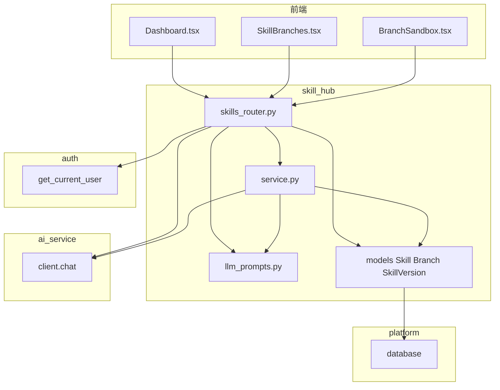
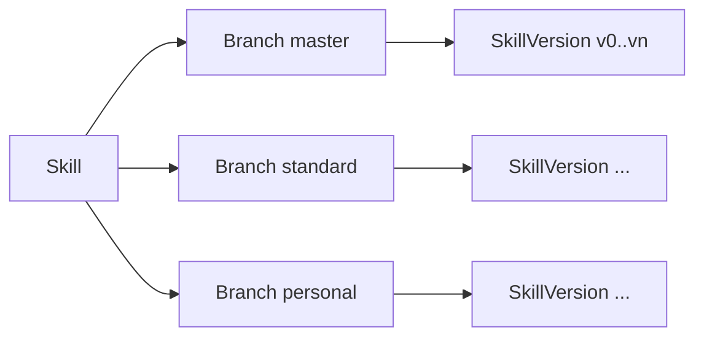

# skill_hub 模块

> 代码路径：`backend/app/skill_hub/`  
> 路由前缀：`/api/skills`

---

## 1. 模块架构

**分支模型**

---

## 2. HTTP 接口 — `/api/skills`

| 方法 | 路径 | 鉴权 | 说明 |
|------|------|------|------|
| GET | `/skills/tags/suggestions` | JWT | 历史 tag 联想（`?q=`） |
| GET | `/skills/categories` | JWT | 启用中的分类 |
| GET | `/skills/categories/manage` | JWT Admin | 全部分类（含停用） |
| POST | `/skills/categories` | JWT Admin | 新建分类 |
| PUT | `/skills/categories/{id}` | JWT Admin | 更新分类 / 启停 |
| GET | `/skills` | JWT | Skill 列表（可选 `?category=` 筛选） |
| POST | `/skills` | JWT | 创建 Skill（**category 必选**，tags 可选） |
| PATCH | `/skills/{skill_id}` | JWT | 更新 tags（创建者/Admin）或 category（Admin） |
| GET | `/skills/{skill_id}` | JWT | Skill 详情 |
| GET | `/skills/{skill_id}/branches` | JWT | 分支列表（含 user 信息） |
| POST | `/skills/{skill_id}/branches` | JWT | 当前用户创建 personal 分支（幂等）；**若尚无版本，自动从 standard HEAD 复制首版** |
| GET | `/skills/{skill_id}/branches/{branch_id}/versions` | JWT | 版本列表；打开空 personal 时同样触发自动初始化 |
| POST | `/skills/{skill_id}/branches/{branch_id}/versions` | JWT | 提交新版本；master 仅 Admin |
| POST | `/skills/{skill_id}/merge` | JWT Admin | 合并到 master |
| POST | `/skills/{skill_id}/branches/{branch_id}/fork` | JWT | 从任意 standard 等源分支 Fork 到当前用户 personal（**含 Skill 创建者 Fork 自己的 standard**；平台内置 Skill 禁止） |
| POST | `/skills/{skill_id}/branches/{branch_id}/evaluate-draft` | JWT | Commit 前 LLM 评估 |
| POST | `/skills/resolve` | JWT | SkillRef → ResolvedSkill |
| POST | `/skills/structure-from-text` | JWT | **纯文本 → 九维结构化**（调用 `LangGPT_Standard_v3` Meta-Skill） |
| GET | `/skills/by-name/{skill_name}` | JWT | **按 name 获取发布版 Markdown**（master 最新；无则 standard） |
| POST | `/skills/by-name/{skill_name}/invoke` | JWT | **按 name 同步调用**（master 最新 payload 为 system） |
| POST | `/skills/{skill_id}/debug/run` | JWT | **Skill 沙箱调试**（同步 LLM，不写库） |

---

## 3. 谁调用哪些接口

### 3.1 前端 → skill_hub

| 页面 | 接口 | 封装 `skillsApi` |
|------|------|------------------|
| Dashboard | GET/POST `/skills` | list, create |
| SkillBranches | GET branches, POST branches | listBranches, createBranch |
| BranchSandbox | GET versions, POST versions | getVersions, createVersion |
| BranchSandbox | POST evaluate-draft, fork, merge | evaluateDraft, fork, merge |

前端文件：`frontend/src/shared/api/client.ts`

### 3.2 后端内部

| 调用方 | 被调 | 说明 |
|--------|------|------|
| skills_router | `service.get_skill_by_name` | 按 name 查 Skill |
| skills_router | `service.generate_ai_commit_summary` | 新版本异步 diff 摘要 |
| skills_router | `ai_service.client.chat` + `llm_prompts` | evaluate-draft |
| external_api | `service.get_master_latest_version` | 取 master 最新版 |
| external_api | `service.version_to_langgpt_payload` | 拼 LangGPT 文本 |

### 3.3 依赖其它模块

| 依赖 | 用途 |
|------|------|
| auth `get_current_user` | 所有 skills 路由 |
| auth `UserRole.Admin` | Merge；**master 写入** |
| `platform.database` | ORM |
| ai_service `client.chat` | LLM 调用；prompt 见本模块 `llm_prompts.py` |

---

## 4. 内部 Python API（供其它 App import）

> 总规范：[module_internal_api.md](../module_internal_api.md)

### 4.1 本模块对外暴露（`skill_hub.service`）

| 函数 | 签名要点 | 允许调用方 |
|------|----------|------------|
| `get_skill_by_name` | `(db, name) → Skill \| None` | **external_api** |
| `get_master_latest_version` | `(db, skill) → SkillVersion \| None` | **external_api** |
| `version_to_langgpt_payload` | `(v) → str` | **external_api**, skills_router |
| `version_to_fields` | `(v) → dict` | **external_api** |
| `get_skill_version` | `(db, version_id)` | 仅 skills_router（模块内） |
| `get_latest_version_num` | `(db, branch_id)` | 仅 skills_router（模块内） |
| `generate_ai_commit_summary` | async | 仅 skills_router（模块内） |

**ORM 模型** `Skill`, `Branch`, `SkillVersion`：仅 `platform.factory` 注册 metadata；其它 App **禁止**直接 `db.query(Skill)`，须走 `service`。

### 4.2 本模块允许依赖

| 被调模块 | 允许符号 |
|----------|----------|
| `auth.service` | `get_current_user` |
| `auth.models` | `User`, `UserRole` |
| `platform.database` | `get_db`, `SessionLocal` |
| `ai_service.client` | `chat` |

### 4.3 禁止

- 其它 App import `skills_router`, `schemas`, `utils`
- 本模块 **不得** import translate / external_api / platform.changelog

---

## 5. 数据库

| 表 | 说明 |
|----|------|
| `skills` | Skill 根 |
| `branches` | FK → skills, users |
| `skill_versions` | FK → skills, branches；**`payload` 单列**存 LangGPT 九维 Markdown |

**分支写权限**

| 分支 | 谁可写 |
|------|--------|
| `master` | **仅 Admin**（含 Merge；创建者不可直接 Commit） |
| `standard` | 创建者（分支主人）或 Admin |
| `personal` | 分支主人或 Admin |

创建 personal 分支或首次打开空 personal 时，后端会从 `standard` 最新版本自动复制 `v0`，避免空分支无法编辑。

创建 Skill 时：`standard.user_id` = 创建者；`master.user_id` = 平台 Admin。

**Fork**：任意登录用户（含 standard 分支创建者）可将源分支最新版本快照复制到自己的 `personal` 分支；`platform_locked` Skill 禁止 Fork。

**存储策略**：DB 只存 `payload`；HTTP API 仍暴露九维 JSON 字段（`skill_version_to_out` 读时解析，写时 `dimensions_to_payload` 组装）。前端无需改动。

详见 [database.md](../database.md)。

---

## 6. 跨模块版本引用（SkillRef）

- **模型**：`skill_ref.py` — `SkillRef` / `ResolvedSkill`
- **解析**：`service.resolve_skill_ref()` — 唯一入口
- **HTTP**：`POST /api/skills/resolve`
- **版本字段**：`revision`（Skill 全局）、`source_version_id`（Merge/Fork 溯源）
- **前端**：`SkillRefPicker` / `SkillRefSummary`（Admin 面板可调试）

业务模块存 `skill_ref_json`，任务启动时固化 `resolved_version_id`。详见 [skill_ref_design.md](../skill_ref_design.md)。

---
