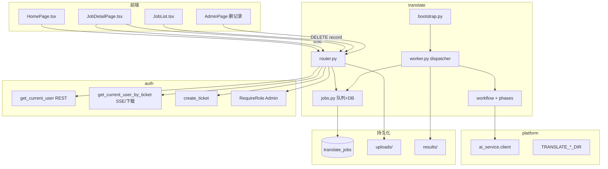
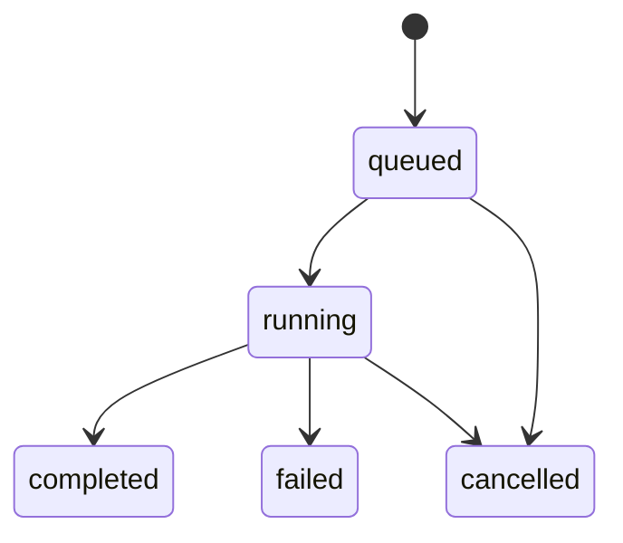

# translate 模块

> 代码路径：`backend/app/translate/`  
> 路由前缀：`/api/translate`

---

## 1. 模块架构

**任务状态机**

---

## 2. HTTP 接口

| 方法 | 路径 | 鉴权 | 说明 |
|------|------|------|------|
| POST | `/ticket` | JWT（`get_current_user`） | 颁发 30s 一次性 ticket |
| GET | `/prompts` | ticket（`get_current_user_by_ticket`） | 下载 prompts.zip |
| POST | `/jobs` | JWT | multipart 上传 ZIP + 可选 `name`，创建任务 |
| GET | `/jobs` | JWT | 全部任务列表（登录用户共享可见） |
| GET | `/jobs/{job_id}` | JWT | 任务详情 |
| POST | `/jobs/{job_id}/cancel` | JWT | 取消 queued/running（**仅本人或 Admin**） |
| DELETE | `/jobs/{job_id}/record` | **Admin** | 删除 DB 记录（非运行中） |
| GET | `/jobs/{job_id}/stream` | ticket | **SSE** 进度 |
| GET | `/jobs/{job_id}/download` | ticket | 下载结果 ZIP |

**凭证**：REST 用 `Authorization: Bearer`；SSE/下载用 query `?ticket=`（先 POST `/ticket` 用 JWT 换 ticket）。

**已移除**：`POST /upload`（→ `POST /jobs`）、`DELETE /jobs/{id}` 取消（→ `POST .../cancel`）、`GET /jobs/{id}/file` 单文件预览。

---

## 3. 谁调用哪些接口

### 3.1 前端 → translate

| 前端 | 接口 | 封装 |
|------|------|------|
| `HomePage` | createJob, listJobs, prompts | `translate-jobs.ts` |
| `JobList` | cancel, download, delete record | 同上 |
| `JobDetailPage` | getJob + SSE + download | `getJob` + `translate-sse` + `getDownloadUrl` |
| `AdminPage` | listJobs, deleteJobRecord | `translate-jobs` |

前端 API 层：

- `frontend/src/shared/api/translate-client.ts` — `apiFetch`, `fetchTicket`
- `frontend/src/shared/api/translate-jobs.ts`
- `frontend/src/shared/api/translate-sse.ts` — `EventSource`

### 3.2 后端内部

| 组件 | 调用 |
|------|------|
| `router.create_job` | `jobs.create_job`, `worker.dispatch_queued` |
| `worker` / `workflow` | `audit` → `ai_service.client.chat`；`result_zip` 等 |
| `platform.registry` | `bootstrap.migrate_schema`, `bootstrap.on_startup` |

### 3.3 依赖其它模块

| 模块 | 用途 |
|------|------|
| auth | 鉴权 + ticket |
| ai_service | 各 phase LLM |
| platform.config | 上传/结果目录 |

**不依赖** skill_hub / platform.changelog 表。

---

## 5. 内部 Python API（供其它 App import）

> 总规范：[module_internal_api.md](../module_internal_api.md)

### 5.1 本模块对外暴露（`translate.bootstrap`）

| 函数 | 允许调用方 | 说明 |
|------|------------|------|
| `migrate_schema(engine)` | **platform.registry** | translate_jobs 表列补丁 |
| `on_startup()` | **platform.registry** | 启动 worker |
| `on_shutdown()` | **platform.registry** | 停止 worker |

**ORM** `TranslateJob`：仅 platform.registry 建表。  
**路径** `UPLOAD_DIR` / `RESULT_DIR`：仅 translate 内部，不供其它 App import。

### 5.2 本模块允许依赖

| 被调模块 | 允许符号 |
|----------|----------|
| `auth.service` | `get_current_user`, `get_current_user_by_ticket`, `create_ticket`, `RequireRole` |
| `auth.models` | `User`, `UserRole` |
| `platform.database` | `SessionLocal` |
| `platform.config` | `TRANSLATE_*_DIR`, `MAX_CONCURRENT_JOBS` |
| `ai_service.client` | `chat` |

### 5.3 禁止

- 其它 App import `translate.router`, `jobs`, `worker`, `workflow`, `phases/*`
- 本模块 **不得** import skill_hub / platform.changelog / external_api

---

## 6. 数据库与磁盘

| 存储 | 说明 |
|------|------|
| 表 `translate_jobs` | 元数据、进度、路径指针 |
| `TRANSLATE_UPLOAD_DIR` | 解压目录 + 流水线中间文件 |
| `TRANSLATE_RESULT_DIR` | `{job_id}.zip` |

详见 [database.md](../database.md)。

---

*designed by @yuzechao*
