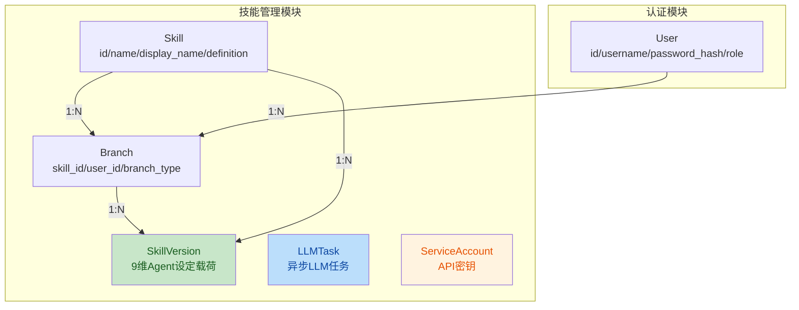

# TestAI Community 代码评审报告

> 评审日期：2026-06-08
> 评审范围：`G:/github/testai_community/backend/` 全部 Python 源代码
> 评审工具：DeepSeek-V4-Pro

---

## 一、项目概述

TestAI Community 是一个统一测试资产管理与 AI 翻译平台，将原有的 `skill_hub`（技能管理）和 `recorder_translate_server`（AI 翻译）两个独立服务合并为单一应用。

**技术栈**: FastAPI + SQLAlchemy + SQLite + JWT + MiniMax LLM API

---

## 二、架构变更概述

本次合并将两个独立后端服务整合到统一入口 `main_merged.py` 中：

```mermaid
flowchart LR
    A[main_merged.py<br/>统一入口 :48010] --> B[/api/auth/*<br/>认证路由]
    A --> C[/api/skills/*<br/>技能管理]
    A --> D[/api/llm/*<br/>LLM 路由]
    A --> E[/api/v1/integration/*<br/>集成路由]
    A --> F[/translate<br/>app.mount 挂载]
    F --> G[translate/app.py<br/>独立FastAPI实例]
    style A fill:#c8e6c9,color:#1a5e20
    style G fill:#bbdefb,color:#0d47a1
```

**数据模型架构:**



---

## 三、问题汇总表

| No. | 严重度 | 问题标题 | 建议 | 代码位置 |
|-----|--------|----------|------|----------|
| 1 | 🔴 致命 | 硬编码 API 密钥 | 立即将密钥移至环境变量，并轮换已泄露的密钥 | [config.py:L10](file:///g:/github/testai_community/backend/app/core/config.py#L10) |
| 2 | 🔴 致命 | main.py 存在错误导入路径 | 修正为与 main_merged.py 一致的导入，或删除此废弃文件 | [main.py:L6-L10](file:///g:/github/testai_community/backend/app/main.py#L6-L10) |
| 3 | 🔴 致命 | seed_db.py 使用不存在模块路径 | 修正为 `app.auth.models`、`app.auth.service`、`app.skill_hub.models` | [seed_db.py:L35-L37](file:///g:/github/testai_community/backend/scripts/seed_db.py#L35-L37) |
| 4 | 🔴 致命 | integration_router.py 引用不存在字段 | `rules` → `constraints`；移除 `current_version` 引用 | [integration_router.py:L32-L51](file:///g:/github/testai_community/backend/app/skill_hub/integration_router.py#L32-L51) |
| 5 | 🔴 致命 | migration 脚本引用已删除的字段 | 更新匹配当前 SkillVersion 模型的 9 维字段 | [migrate_to_5fields.py:L22-L28](file:///g:/github/testai_community/backend/app/skill_hub/migrate_to_5fields.py#L22-L28) |
| 6 | 🔴 致命 | seed_db.py 使用无效 branch_type "standard" | 改为 `template` | [seed_db.py:L177](file:///g:/github/testai_community/backend/scripts/seed_db.py#L177) |
| 7 | 🟠 高危 | API 密钥明文存储且无哈希比较 | 使用 bcrypt 哈希存储 API Key | [integration_service.py:L23-L31](file:///g:/github/testai_community/backend/app/skill_hub/integration_service.py#L23-L31) |
| 8 | 🟠 高危 | security.py 与 service.py 存在重复代码 | 删除 service.py 中的重复，统一使用 core/security.py | [security.py:L14-L34](file:///g:/github/testai_community/backend/app/core/security.py#L14-L34) |
| 9 | 🟠 高危 | CORS 配置 allow_origins="*" 与 allow_credentials=True 同时存在 | 移除 allow_credentials 或限制具体域名 | [main_merged.py:L33-L39](file:///g:/github/testai_community/backend/app/main_merged.py#L33-L39) |
| 10 | 🟡 中危 | translate/__main__.py 引用不存在的模块路径 | 修正为 `app.translate.app:app` | [__main__.py:L20](file:///g:/github/testai_community/backend/app/translate/__main__.py#L20) |
| 11 | 🟡 中危 | main_merged.py 存在未使用的导入 | 删除 `translate_jobs` 导入 | [main_merged.py:L30](file:///g:/github/testai_community/backend/app/main_merged.py#L30) |
| 12 | 🟡 中危 | 缺少密码强度校验 | 在 UserRegister 添加 min_length 及复杂度要求 | [schemas.py:L4-L7](file:///g:/github/testai_community/backend/app/auth/schemas.py#L4-L7) |
| 13 | 🟡 中危 | _async_diff_task 存在脆弱的嵌套异常处理 | 重构为扁平化结构，使用独立 session | [skills_router.py:L67-L83](file:///g:/github/testai_community/backend/app/skill_hub/skills_router.py#L67-L83) |

---

## 四、问题详细分析

### 🔴 致命问题

#### 1. 硬编码 API 密钥

**文件**: [config.py:L10](file:///g:/github/testai_community/backend/app/core/config.py#L10)

```python
MINIMAX_API_KEY = "sk-cp-aXV4X8TlWZeR3E1hpIaPtjEFnafrpbEi_IMlm6NhSY_0-CQHOV5WupxDkg4LV2JXfB3sO_AoGodPCkQ6irIC7PuIoxC29MVKqG70AYz_hQ1VIjNDgSpCvOo"
```

**问题**: MiniMax API 密钥以明文硬编码在源代码中，且已提交至代码仓库。任何有仓库访问权限的人均可读取。

**修复**:
```python
MINIMAX_API_KEY = os.getenv("MINIMAX_API_KEY", "")
```
同时需立即在 MiniMax 控制台轮换此已泄露的密钥。

---

#### 2. main.py 存在错误导入路径

**文件**: [main.py:L6-L10](file:///g:/github/testai_community/backend/app/main.py#L6-L10)

```python
from app.skill_hub.router import router as skill_router    # ❌ 不存在 router.py
from app.skill_hub.router import router as llm_router      # ❌ 
from app.skill_hub.router import router as integration_router  # ❌
from app.skill_hub.service import ServiceAccount           # ❌ 实际在 integration_service.py
from app.skill_hub.models import LLMTask                   # ❌ 实际在 integration_models.py
```

**问题**: 所有 `from app.skill_hub.router import ...` 的导入路径均不存在（实际文件为 `skills_router.py`、`llm_router.py`、`integration_router.py`）。此外，`ServiceAccount` 位于 `integration_service.py`，`LLMTask` 位于 `integration_models.py`。

**说明**: `main.py` 看起来是旧版入口（入口已切换至 `main_merged.py`），但保留着一个无法运行的入口文件会造成混淆。

**修复**: 删除 `main.py`，或将其导入修正为：
```python
from app.skill_hub.skills_router import router as skill_router
from app.skill_hub.llm_router import router as llm_router
from app.skill_hub.integration_router import router as integration_router
from app.skill_hub.integration_service import ServiceAccount
from app.skill_hub.integration_models import LLMTask
```

---

#### 3. seed_db.py 使用不存在的模块路径

**文件**: [seed_db.py:L35-L37](file:///g:/github/testai_community/backend/scripts/seed_db.py#L35-L37)

```python
from app.domains.iam.models import User, UserRole        # ❌ 不存在
from app.domains.iam.service import hash_password         # ❌ 不存在
from app.domains.assets.models import Skill, Branch, SkillVersion  # ❌ 不存在
```

**问题**: 导入路径 `app.domains.iam.*` 和 `app.domains.assets.*` 在当前项目结构中不存在。正确路径为：
```python
from app.auth.models import User, UserRole
from app.auth.service import hash_password
from app.skill_hub.models import Skill, Branch, SkillVersion
```

---

#### 4. integration_router.py 引用不存在字段

**文件**: [integration_router.py:L32-L51](file:///g:/github/testai_community/backend/app/skill_hub/integration_router.py#L32-L51)

```python
latest_version.rules,         # ❌ SkillVersion 模型实际字段为 constraints
skill.current_version,        # ❌ Skill 模型无此字段
latest_version.workflow,      # ❌ 实际字段为 workflows（复数）
```

**问题**: `integration_router.py` 和 `integration_service.py` 中多处引用了不存在的字段名。模型 `SkillVersion` 的 9 维字段名如下：
- `constraints`（不是 `rules`）
- `workflows`（不是 `workflow`）
- `output_format`、`initialization`（不是 `initialization`/`init_message`）

同时 `skill.current_version` 在 `Skill` 模型中不存在，需要改为查询该 skill 的最新版本。

---

#### 5. migrate_to_5fields.py 引用已删除字段

**文件**: [migrate_to_5fields.py:L22-L28](file:///g:/github/testai_community/backend/app/skill_hub/migrate_to_5fields.py#L22-L28)

```python
if hasattr(v, "langgpt_payload") and v.langgpt_payload:  # ❌ 该字段已删除
    ...
    v.rules = fields["rules"]  # ❌ 实际字段为 constraints
```

**问题**: 迁移脚本是为旧版模型设计的，当前 `SkillVersion` 已重构为 9 维结构。`langgpt_payload` 字段已被删除，`rules` 已更名为 `constraints`。此脚本需要完全重写或删除。

---

#### 6. seed_db.py 使用无效 branch_type "standard"

**文件**: [seed_db.py:L177](file:///g:/github/testai_community/backend/scripts/seed_db.py#L177)

```python
standard_branch = _add_branch(db, skill.id, admin.id, "standard")  # ❌ 不在允许范围内
```

**问题**: `Branch.branch_type` 的设计约定仅限 `master` / `template` / `personal` 三种。`"standard"` 为无效值。

---

### 🟠 高危问题

#### 7. API 密钥明文存储且无哈希比较

**文件**: [integration_service.py:L23-L31](file:///g:/github/testai_community/backend/app/skill_hub/integration_service.py#L23-L31)

```python
class ServiceAccount(Base):
    token_hash = Column(String, nullable=False)   # ❌ 实际存储明文，字段名误导

def verify_api_key(x_api_key: str = Header(...), db):
    for account in accounts:
        if account.token_hash == x_api_key:      # ❌ 直接字符串比较
            return account
```

**问题**: 字段命名 `token_hash` 暗示已哈希，但实际存储的是明文 API 密钥。比较时也是直接字符串比较，无法抵抗数据库泄露攻击。

**修复**: 使用 `passlib` 中的 bcrypt 对 API Key 做哈希存储，验证时使用 `pwd_context.verify()`。

---

#### 8. security.py 与 auth/service.py 存在重复代码

**文件**: [security.py:L14-L34](file:///g:/github/testai_community/backend/app/core/security.py#L14-L34) / [service.py:L42-L63](file:///g:/github/testai_community/backend/app/auth/service.py#L42-L63)

两个文件中的 `get_current_user` 函数实现完全一致（逐字符相同），`security_scheme` 也重复定义。

**问题**: 代码重复增加了维护成本。如果认证逻辑需要变更，必须同时修改两处。
- `skills_router.py` 使用 `from app.auth.service import get_current_user`
- `security.py` 中的版本似乎未被实际使用

**修复**: 删除 `auth/service.py` 中的 `get_current_user` 和 `security_scheme` 定义，统一从 `core/security.py` 导入。

---

#### 9. CORS 配置不安全

**文件**: [main_merged.py:L33-L39](file:///g:/github/testai_community/backend/app/main_merged.py#L33-L39)

```python
app.add_middleware(
    CORSMiddleware,
    allow_origins=["*"],
    allow_credentials=True,    # ❌ 与 allow_origins=["*"] 冲突
    allow_methods=["*"],
    allow_headers=["*"],
)
```

**问题**: CORS 规范禁止在 `allow_origins=["*"]` 时同时设置 `allow_credentials=True`。浏览器会拒绝此类跨域请求。

**修复**: 移除 `allow_credentials=True`，或改为具体的允许域名列表。`main_combined.py` 存在相同问题。

---

### 🟡 中危问题

#### 10. translate/__main__.py 引用不存在的模块路径

**文件**: [__main__.py:L20](file:///g:/github/testai_community/backend/app/translate/__main__.py#L20)

```python
uvicorn.run(
    "recorder_translate_server.server.app:app",  # ❌ 原项目路径
```

**问题**: 引用的是原项目 `recorder_translate_server` 的路径，在合并后的项目结构中不存在。应改为 `app.translate.app:app`。

---

#### 11. main_merged.py 存在未使用的导入

**文件**: [main_merged.py:L30](file:///g:/github/testai_community/backend/app/main_merged.py#L30)

```python
from app.translate import jobs as translate_jobs  # ❌ 导入后从未使用
```

---

#### 12. 缺少密码强度校验

**文件**: [schemas.py:L4-L7](file:///g:/github/testai_community/backend/app/auth/schemas.py#L4-L7)

```python
class UserRegister(BaseModel):
    username: str
    password: str           # ❌ 无长度限制
```

**问题**: 密码字段无最小长度或复杂度要求，用户可以设置空字符串或极短密码。

**修复**:
```python
password: str = Field(..., min_length=8, description="密码，至少8位")
```

---

#### 13. _async_diff_task 存在脆弱的嵌套异常处理

**文件**: [skills_router.py:L67-L83](file:///g:/github/testai_community/backend/app/skill_hub/skills_router.py#L67-L83)

```python
try:
    v.ai_commit_summary = await generate_ai_commit_summary(prev, v)
    db.commit()
except Exception as e:
    db.rollback()
    try:
        v2 = db.query(...).first()    # ❌ rollback 后再查询状态不确定
        if v2:
            v2.ai_commit_summary = f"生成失败: {e}"
            db.commit()
    except Exception:
        db.rollback()
```

**问题**: 外层 `rollback()` 后立即在新隐式事务中查询，如果此查询失败，第二个 `rollback()` 会使 session 处于不确定状态。且外层 `except Exception` 会静默吞掉所有异常。

**修复**: 使用独立的 `SessionLocal()` 处理错误写回：
```python
except Exception as e:
    db.rollback()
    err_db = SessionLocal()
    try:
        v2 = err_db.query(SkillVersion).filter(SkillVersion.id == version_id).first()
        if v2:
            v2.ai_commit_summary = f"生成失败: {e}"
            err_db.commit()
    finally:
        err_db.close()
```

---

## 五、修复后的代码示例

### config.py 修复

```python
import os

SECRET_KEY = os.getenv("SECRET_KEY", "qa-skillhub-secret-key-change-in-production")
ALGORITHM = "HS256"
ACCESS_TOKEN_EXPIRE_MINUTES = 60 * 24

DATABASE_URL = os.getenv("DATABASE_URL", "sqlite:///./database.sqlite")

MINIMAX_API_KEY = os.getenv("MINIMAX_API_KEY", "")
MINIMAX_API_URL = os.getenv("MINIMAX_API_URL", "https://api.minimax.chat/v1/text/chatcompletion_v2")
```

### integration_service.py 修复

```python
from passlib.context import CryptContext

pwd_context = CryptContext(schemes=["bcrypt"], deprecated="auto")

class ServiceAccount(Base):
    __tablename__ = "service_accounts"
    id = Column(Integer, primary_key=True, index=True)
    token_hash = Column(String, nullable=False)
    name = Column(String, nullable=False)
    created_at = Column(DateTime(timezone=True), server_default=func.now())

def verify_api_key(
    x_api_key: str = Header(..., alias="X-API-Key"),
    db: Session = Depends(get_db),
) -> ServiceAccount:
    accounts = db.query(ServiceAccount).all()
    for account in accounts:
        if pwd_context.verify(x_api_key, account.token_hash):
            return account
    raise HTTPException(
        status_code=status.HTTP_401_UNAUTHORIZED,
        detail="无效的API密钥",
    )
```

### seed_db.py 修复

```python
from app.auth.models import User, UserRole
from app.auth.service import hash_password
from app.skill_hub.models import Skill, Branch, SkillVersion
# ...
standard_branch = _add_branch(db, skill.id, admin.id, "template")  # standard → template
```

### main_merged.py 修复

```python
# 删除第 30 行:
# from app.translate import jobs as translate_jobs

# CORS 修复:
app.add_middleware(
    CORSMiddleware,
    allow_origins=["*"],
    allow_credentials=False,
    allow_methods=["*"],
    allow_headers=["*"],
)
```

---

## 六、总结

| 类别 | 数量 | 说明 |
|------|------|------|
| 🔴 致命 | 6 | 服务无法启动或存在严重安全漏洞 |
| 🟠 高危 | 3 | 存在安全风险或代码质量显著问题 |
| 🟡 中危 | 4 | 存在潜在风险或代码异味 |
| **总计** | **13** | |

**整体评价**: 项目架构设计合理，三层（auth / skill_hub / translate）模块划分清晰，数据模型设计（3 张表 + 9 维 Agent 设定）有明确的领域意图。主要问题集中在合并迁移过程中未清理干净的旧代码引用和导入路径不一致，以及安全配置方面（硬编码密钥、明文存储）的疏忽。建议优先修复 6 个致命问题确保服务可正常运行，然后修复 3 个高危问题加固安全防线。